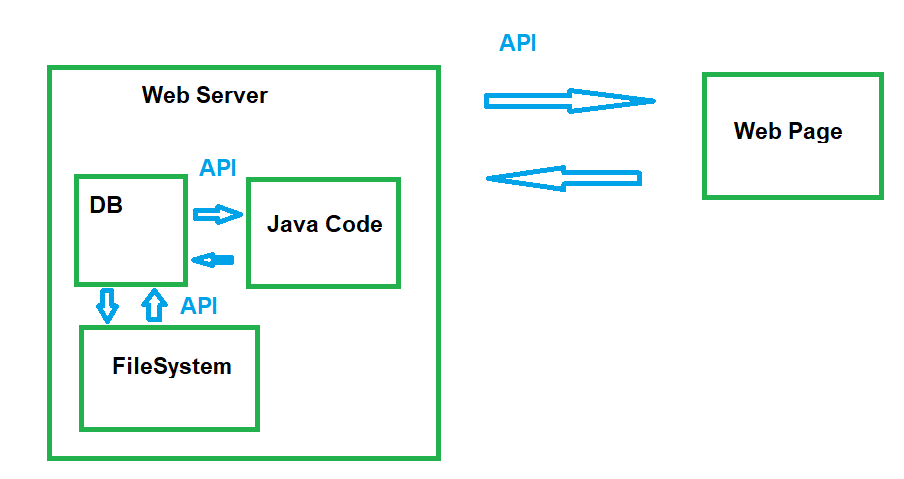
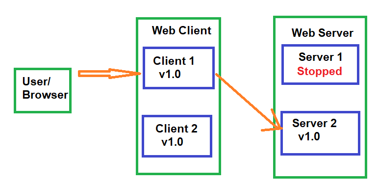
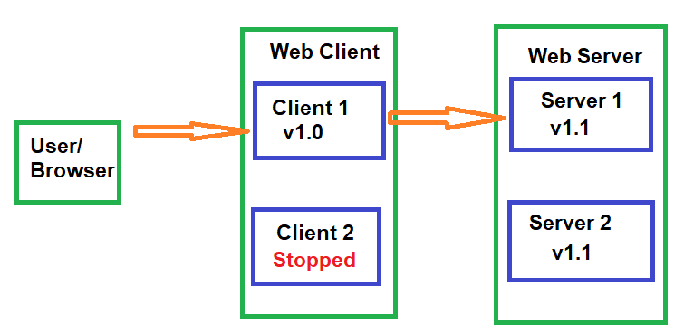

---

marp: true
size: 16:9
marp: true
theme: default

---

# APIs

---

# Top-Down vs Bottom-Up Design

---

## Bottom-Up Design

### Common pitfall: Starting with the details first

Your first instinct is to start coding the first component you think of, then move on to the next, and so on. This often leads to a tangled mess of code that is difficult to maintain and extend.

---

## Top-Down Design

#### Better solution: Decide how the components fit together, then build them

Figuring out the overall architecture first allows you to focus on one component at a time, and makes it easier to reason about how the system works as a whole.

---

## Building a System

We have decided on the Top-Down approach, but how do we actually build a system? And how do the components interact with each other?

Let's start with component communication. 

---

# What is an API?

**A**pplication **P**rogramming **I**nterface

 - It sits between **layers** or **components** in a system and allows them to communicate with each other.
- It defines a **contract** for how the components will behave.
- It encompasses everything an external component **relies on** to interact with the system.
---

# API Example

### Cars have an API:

- Use the steering wheel to steer
- The gas to go
- The brake to stop

### Users don't need to know the details:

- Drive\-by\-wire vs mechanical linkages

- Different types of brake disks

- How an internal combustion engine works

---

  

# Why APIs?

Allows  __interacting__ with a component without knowing the  __details__ of how it works

### Important for scaling software:

- Each piece is complicated\, no one can keep track of all details at once

### APIs let you focus on just one piece at a time

- Any separation between components has an  **implicit**  API\,  not necessarily a good one \(organic APIs are usually bad\)

### Side benefit: Promotes better design

- Highly\-coupled components tend to be  __fragile__

- APIs push design to a  __top\-down__  approach\, which produces more flexibility 

---
# Component APIs

Any boundary between components needs an API:

- **Network** boundary

- **Process** boundary

- **Conceptual** boundary

---

# System Design Diagram

- Used to identify where APIs are needed

- Helpful first step before architecting a large system

- Useful for parallelizing work across many people/teams

- Acts like an informal UML

Start with an overall workflow for the system

__Initial Layout: __ For each step\, assign it to a component \- draw a  __box __ and label it

__Environmental Features: __ Surround any components that live on either the same physical  __server __ or in the same  __process __ with an extra box

__Interactions: __ Each time a component interacts with another\, draw an  __arrow __ to connect them \- these will be the APIs

__Simplify: __ Sometimes two components will be the  __request/response__  steps for a single user action; identify these and combine them into a single component\. Similarly\, if any components are the  __only component __ within a server/process boundary\, you can remove the double\-box around them\.

__Note: __ a component from 'outside' a box should only interact with the outermost layer\, which in turn will interact with internal components; this separates external and internal APIs to simplify backwards\-compatibility guarantees

When have you simplified enough?

\- Whenever possible\, have  __pairs of arrows__  between components representing  __request/response __ pairs

A system with a  __single arrow__  is unusual and more complicated:

A single arrow means there  __is no response__  to indicate that a task is completed\, successful\, or failed

Any such system also needs components to  __monitor and potentially redo __ the task in question

# Systems Design Diagrams - Removing Single Arrows

Protocols with no response \(SMTP\): "resend this email"

No way to remove the single arrow\, just build a way to re\-send

Tasks with delayed response:

Add some sort of id/lookup key response

Add another component to "check status" using the key

ex: placing an order on a website returns an order number\, which allows someone to look up the status of the order over several days

# Systems Diagrams Example

Example: Adding a 'Search' feature to an application

__Overall workflow__ :

A user will enter terms in the search bar and hit enter\. That request will go to a server that will create a parsed version of the query\, then compare that against indexed data\. The results will be compiled into a user\-friendly format and then returned to the application\.

__Overall workflow__ :

A user will enter terms in the search bar and hit enter\. That request will go to a server that will create a parsed version of the query\, then compare that against indexed data\. The results will be compiled into a user\-friendly format and then returned to the application\.

__Step 1:__  Create a component for each step

__Step 2:__  Add server/process boundary boxes

__Step 3:__  Draw component interactions

__Step 4:__  Combine request/response components & remove extra boxes

Now we can read the required APIs off the diagram:

one network API from the search bar to the network\-facing server \(needs  __wire __ compatibility\)

one internal/in\-process API from the networking layer to the query\-parsing/translation component

one internal/in\-process API from the parsing component to the indexed data searching component\.

# Your turn!

Create a systems diagram for the following workflow:

A user will enter data in a website form and submit it\. That information will get sent to the server\, which will transform it into a SQL query and send that to a database\. The database results will get transformed back into javascript\-friendly results\, and returned to the website to be displayed\.

Run through the four steps to create the systems diagram:

__Initial Layout: __ For each step\, assign it to a component \- draw a  __box __ and label it

__Environmental Features: __ Surround any components that live on either the same physical  __server __ or in the same  __process __ with an extra box

__Interactions: __ Each time a component interacts with another\, draw an  __arrow __ to connect them \- these will be the APIs

__Simplify: __ Sometimes two components will be the  __request/response__  steps for a single user action; identify these and combine them into a single component\. Similarly\, if any components are the  __only component __ within a server/process boundary\, you can remove the double\-box around them\.

# Web Form Systems Diagram

A user will enter data in a website form and submit it\. That information will get sent to the server\, which will transform it into a SQL query and send that to a database\. The database results will get transformed back into javascript\-friendly results\, and returned to the website to be displayed\.

# Web Form Systems Diagram (Alt)

What's different here?

Why would you choose one vs the other?

# Designing the API

The API is the layer  __between__  components\, and acts as a  __contract__  between them

Each component has a copy of the contract\, but "the API" isn't a single piece of code

# Designing a Good API

APIs should be designed from the perspective of the  __user__ \, not the implementer

Avoids a "leaky abstraction"\, where details of how a component works end up in the API

Captures behavior\, not data \(although the line can be blurry\)

Needs enough power to be useful\, but also an easy learning curve

Make the common things easy\, and the weird things possible

Remember: you can always  __add__  things to an API\, but it's difficult to  __remove__  or  __change __ things

Initially\, aim for a Minimum Viable Product \(MVP\) approach \- what's the smallest set of things that will let a user accomplish what they need to

# Backwards Compatibility

For widely used\, public\, open source projects \(Ex: protocol buffers\, the JRE\):

Many clients

No complete list of all clients\, much less access to their code

⇒ Breaking changes are a Big Deal\, and very rare

Ever wondered why generics are wonky in Java? To maintain 1\.4/1\.5 compatibility

Some APIs have a narrower scope: within a company\, team\, or project

Backwards compatibility is still important\!

Consider a simple web server: a client process and a server process

When upgrading\, one option is to turn everything off\, upgrade everything\, and then turn it back on

Ex: "Caution: AmateurHour\.com will be going down for maintenance from 3am to 6am on Friday"

# Online Updates

Better option: At least 2 copies of every process with network failover\.

Ex: a user is connected to Client 1\, which starts off connected to Server 1; both clients/servers are running identical software

To update to v1\.1: first stop the Server 1 process\. Client 1 will fail over to Server 2; this will at worst cause a browser\-refresh style hiccup for a user\, but typically it's not noticeable

Now\, update the binaries on the server\, start Server 1 back up\, and do the same for Server 2

Once the servers are updated\, the clients can get sequentially updated as well\. All of this relies on a client running v1\.0 still being able to talk to a server with v1\.1\, which means the API must be  __backwards compatible__  for at least one version

In practice\, this whole process is often automated\, with Server 1 having to pass some automated health checks before Server 2 gets upgraded\, as part of a  __continuous deployment__  pipeline

# Types of Backwards Compatibility

APIs are contract between different components\, which may change and upgrade at different rates\, with different people

It's important to maintain  __backwards compatibility__  with an API

What type of backward compatibility is actually  __part__  of the API:

Source compatibility: code written with a previous version still compiles

Wire compatibility: an application built against a previous version can still talk to a new server

Semantic compatibility: an application's behavior doesn't change

# Examples of Breaking Changes

Source compatibility: code written with a previous version still compiles

Previous API:

public Set\<Object> createCollection\(\);

Breaking Change:

public Collection\<Object> createCollection\(\);

Non\-breaking Change: returning a HashSet instead of a TreeSet

⇒ Make your return types as  __general __ as possible

Wire compatibility: an application built against a previous version can still talk to a new server

Previous API:

Using default Java serialization:

public Widget createWidget\(\);

Breaking Change:

Create a new class that implements Widget and return it; Java serialization will fail on the application side

Non\-breaking Change:

Use an explicitly backwards/forwards compatible wire format such as JSON or protocol buffers

⇒ Make  __serialization __ and  __persistence__  explicit parts of the API

# Design For Change - Versioning

Any time something is  __serialized __ or  __persisted__  it should have a version number

Default for java Serializable is serialVersionUID

Two major properties:

The version number should an incrementing sequence

Version should be automatically set given the compiled version of the code: ex: protocolBufferBuilder\.setVersion\(VERSION\);

# Examples of Breaking Changes

Semantic compatibility: an application's behavior doesn't change

Previous API:

public float parseString\(String number\) throws NumberFormatException;

Breaking Change:

/\* Returns Float\.NaN if the number doesn't parse \*/

public float parseString\(String number\);

⇒ Build in  __error handling__  from the beginning

__Non\-breaking Change: __

__@deprecated /\*\* Prefer parseStringNoThrow \*/__

__public default float parseString\(String number\) throws NumberFormatException \{__

__  float result = parseStringNoThrow\(number\);__

__  if \(result == Float\.NaN\) \{__

__    throw new NumberFormatException\(\);__

__  \}__

__\} __

__/\* Returns Float\.NaN if the number doesn't parse \*/__

__public float parseStringNoThrow\(String number\);__

# Number of Versions of Compatibility

Large open\-source projects will typically support APIs for many years

Breaking changes are indicated by incrementing the  __major __ version number

Internal\-only or smaller projects may have shorter support windows

Most common is one  __minor__  release

Version numbers: major\.minor\.hotfix/patch \(ex: Java 1\.6\.u45\)

Generally\,  __deprecate__  functionality for one support window\, then remove it

# API Design Feels Backwards

Up until now: I want to build a thing → I go build the thing

New and improved: I want to build a thing → I go do something else entirely\, and then eventually come back to building the thing

Seems  __counterintuitive__ \, but trust the process\! Somewhere around the middle of the semester\, suddenly all that "something else entirely" will really start to pay off

Initial API Design steps don't seem to be  __getting anywhere__

Think of it like an image loading over time \- the first few steps are really blurry\, but they're still important

# API Example: Building a Server For a Website

After building the System Design Diagram\, focus on each API between components

Ex:

A user \(via their browser\) will connect to a web server for a social media site\. Initially\, we just want the user to be able to view their profile and make changes to it\.

__Step 1__ : Identify the  __client__

In this case\, the website frontend

Note that the client isn't always a person\, or the  __end user__  \- the client of an API is the person or \(usually\) program that will be interacting with it directly

# Your Turn! (Part 1 of Many)

After seeing how each piece works with our social media site example\, you’ll implement the same part of the process with a different system

Goal: You've been asked to build a key\-value store system\, where another program can store and retrieve arbitrary bytes of data\.

Step 1: Who is the  __client __ for this system?

# Part 1 Solution

Goal: You've been asked to build a key\-value store system\, where clients can store and retrieve arbitrary bytes of data\.

The  __client __ will likely be another piece of code:

web server

another backend server

probably not an actual person

⇒ The user can be trusted \(mostly\)

⇒ The user \(for a given system\) is likely  __unique__  \- no need to manage different profiles

# API Example: Building a Server For a Website

__Step 2:__  List out what the user needs to be able to do\.

In our case\, that might be:

Log in to the site

Load a profile

Make changes to a profile

# Your Turn! (Part 2)

Goal: You've been asked to build a key\-value store system\, where clients can store and retrieve arbitrary bytes of data\.

The  __client __ will be another piece of code \(some sort of server\)

Step 2: List out what operations the client will need to perform

# Step 2 Solution

Goal: You've been asked to build a key\-value store system\, where clients can store and retrieve arbitrary bytes of data\.

The functionality it needs to support:

Store bytes of data

Later\, look up the corresponding data

# Writing the Actual API

__Step 3:__  Build a prototype

To go from a high\-level approach to the actual code\, build a  __prototype use case__ \.

This isn't an actual website\, or anything that will ever be used; it's to iron out the details to make sure the API is both well\-specified and sufficiently powerful

Where the actual website will have forms for input\, responses to user actions\, etc\, the prototype just focuses on the  __interactions __ with the API

Start with the high\-level approach as comments\, and fill it out as you go

# Writing the Actual API (Next Checkpoint)

Prototypes are frequently  __JUnit Tests__ \, but we won't cover testing until next class\.

For now\, the prototype for SomeApi will have the format:

PrototypeSomeApi\.java:

public  __ __  class  __ __  PrototypeSomeApi  __ \{__

__   __  public  __ __  void  __ prototype\(SomeApi server\) \{__

__	 __  // prototype goes here

__   \}__

__\}__

This code isn't accessible from any code entry points \(no main method or @Test annotation\)\, so it will never  __run__ \, that's ok

Prototype code just needs to  __compile__

# Prototype the Use Case

First\, just add comments

public  __ __  void  __ prototype\(WebServer server\) \{__

__  __  // log in the user

__  __  // load their profile

__  __  // make a change to the profile

__  __  // reload the updated version of the profile

__\}__

This step will often flag functionality that was missed during the initial brainstorming\, such as a 'log out' option

First\, just add comments

public  __ __  void  __ prototype\(WebServer server\) \{__

__  __  // log in the user

__  __  // load their profile

__  __  // make a change to the profile

__  __  // reload the updated version of the profile

     __//__       __logout__ 

__\}__

All fixed\!

# Making Code Compile

The previous slide created a new  __type__  \(WebServer\)

As you're writing the code\, you want it to compile \- when you have a referenced type that you haven't implemented yet\, create it as an  __empty interface:__

WebServer\.java:

public  __ __  interface  __ __  WebServer  __ \{__

__  __  // nothing here yet\!

__\}__

⇒ Your IDE can help you with this\! Try hovering over the red squiggle\, and use the option to create a new type

# Your Turn! (Part 3)

Goal: You've been asked to build a key\-value store system\, where clients can store and retrieve arbitrary bytes of data\.

The  __client __ is another piece of code/other server

The functionality it needs to support:

Store bytes of data

Later\, look up the corresponding data

Create a  __PrototypeDataStore\.java__  with the comments \+ methods version of the API

__Hint__ : This should compile\, so you may need to create an empty interface

# Part 3 Solution

public  __ __  void  __ prototype\(DataStore dataStore\) \{__

__    __  // store some data

__    __  // retrieve the data

__\}__

__DataStore\.java:__

public  __ __  interface  __ __  DataStore  __ \{__

__   __  // nothing here yet

__\}__

# Prototype the Use Case

__Step 4__ : Fill out the template

public  __ __  void  __ prototype\(WebServer server\) \{__

__  __  // log in the user: what do we need to build a LoginRequest?

__  LoginResponse response = server\.login\(__  new  __ LoginRequest\(\)\);__

__  __  // load their profile

__  __  // make a change to the profile

__  __  // reload the updated version of the profile

__  __  // log out

__\}__

Often\, filling in the first few lines doesn't seem like it's actually clarifying anything\, but you'll notice we now have two concrete interfaces and a method\. Remember\, this first pass is still fairly high\-level and vague; leave further needed details as comments

# API Design Best Practice: Always Have a Return Value

LoginResponse login\(LoginRequest loginRequest\);

Why not  __void__ ?

Return values allow you to:

Handle error cases more gracefully

Propagate exceptions across network/process boundaries

Add functionality later without breaking backwards compatibility

# Prototype the Use Case

public  __ __  void  __ testWebServer\(WebServer server\) \{__

__  __  // log in the user: what do we need to build a LoginRequest?

__  LoginResponse loginResponse = server\.login\(__  new  __ LoginRequest\(\)\);__

__  __  // load their profile

__  __  if  __ \(loginResponse\.success\(\)\) \{__

__    ProfileLoadResponse profileLoadResponse = server\.loadProfile\(loginResponse\.getUserIdentifier\(\)\);__

__  \}__

__  __  // make a change to the profile

__  __  // reload the updated version of the profile

__  __  // log out

__\}__

__As we fill out the next few lines\, we'll start to implicitly fill out some of the interfaces; we need to know if the login worked\, and in order to load a profile we need a user id\, which we would have to get from the login info \(good thing we had a response\!\)__

# API Design Best Practice: Wrapper Interfaces

ProfileLoadResponse loadProfile\(UserIdentifier user\);

Why not 'String username' or 'long userId'?

Exactly\!

How the system wants to implement a unique id per user is an  __implementation detail__

Leaving it unspecified allows for a flexible implementation\, or multiple/changing implementations

# Prototype the Use Case

public  __ __  void  __ testWebServer\(WebServer server\) \{__

__  __  // log in the user: what do we need to build a LoginRequest?

__  LoginResponse loginResponse = server\.login\(__  new  __ LoginRequest\(\)\);__

__  __  // load their profile

__  __  if  __ \(loginResponse\.success\(\)\) \{__

__    ProfileLoadResponse profileLoadResponse = server\.loadProfile\(loginResponse\.getUserIdentifier\(\)\);__

__  __  // make a change to the profile: what do we need to create one of these

__    ProfileChangeRequest changeRequest = __  new  __ ProfileChangeRequest\(\);__

__    ProfileChangeResponse profileChangeResponse = server\.updateProfile\(loginResponse\.getUserIdentifier\(\)\, changeRequest\);__

__  __  // reload the updated version of the profile

__  profileLoadResponse = server\.loadProfile\(loginResponse\.getUserIdentifier\(\)\);__

__  __  // log out

__  server\.logout\(loginResponse\.getUserIdentifier\(\)\);__

__  \}__

__\}__

# API Design Best Practice: Many Object Interfaces

ProfileChangeResponse changeProfile\(UserIdentifier user\, ProfileChangeRequest request\);

Shouldn't we be reusing code and combining some of these response values?

Nope\!

Copy\-pasting  __logic __ is bad\, that's something you encapsulate and re\-use

Reusing  __methods__  is also a good idea

On the other hand\, allow wrapper  __interfaces __ to proliferate wildly

Leaving these separate allows for future flexibility

reuse is great for situations where you control all uses of the code\, but APIs are the opposite

tldr:  __Types __ = don't reuse\,  __Methods__  = do reuse

# Writing the actual API: Method Signatures

public  __ __  interface  __ __  WebServer  __ \{__

__  LoginResponse login\(LoginRequest loginRequest\);__

__  ProfileLoadResponse loadProfile\(UserIdentifier user\);__

__  ProfileChangeResponse changeProfile\(UserIdentifier user\, ProfileChangeRequest request\);__

__  LogoutResponse logout\(UserIdentifier user\);__

__\}__

# Your Turn!

Recall from earlier:

public  __ __  void  __ prototype\(DataStore dataStore\) \{__

__    __  // store some data

__    __  // retrieve the data

__\}__

__DataStore\.java:__

public  __ __  interface  __ __  DataStore  __ \{__

__   __  // nothing here yet

__\}__

__Now\, fill out each commented line\, generating interfaces/methods in DataStore as necessary to make everything compile__

# Prototyped Data Storage Layer

public  __ __  void  __ prototype\(DataStore dataStore\) \{__

__  __  // store some data

__  DataStorageResponse storeResponse = dataStore\.storeData\(__  new  __ DataStorageRequest\(\)\);__

__  __  // retrieve the data

__  DataLoadResponse loadResponse = dataStore\.loadData\(storeResponse\.getDataKey\(\)\);__

__\}__

public  __ __  interface  __ __  DataStore  __ \{__

__  DataStorageResponse storeData\(DataStorageRequest request\);__

__  DataLoadResponse loadData\(DataStorageKey key\);__

__\}__

public  __ __  interface  __ __  DataStorageRequest  __ \{__

__  __  // TBD

__\}__

public  __ __  interface  __ __  DataStorageResponse  __ \{__

__  DataStorageKey getDataKey\(\);__

__\}__

public  __ __  interface  __ __  DataStorageKey  __ \{__

__  __  // TBD

__\}__

public  __ __  interface  __ __  DataLoadResponse  __ \{__

__  __  // TBD

__\}__

# Writing the actual API: Filling in the Rest

public  __ __  interface  __ __  LoginResponse  __ \{__

__  __  boolean  __ success\(\); __  // Oh no\! Booleans are bad

__  UserIdentifier getUserIdentifier\(\);__

__\}__

public  __ __  interface  __ __  UserIdentifier  __ \{__

__  __  // marker interface

__\}__

# API Design Best Practice: Booleans are Bad (Usually)

Problem 1: Very inflexible \(only ever has two values\)

What happens if we want to add details about why the login failed?

Problem 2: Not self\-documenting

ex: server\.loadProfile\(true\, false\, true\, true\, false\, ""\);

__The fix__ : Enums

# Enums (Enumerations)

Alternative to listing out a bunch of constants

Use ==\, not \.equals\(\)

Should only be used for known\-at\-compile\-time\, immutable state

# Updated API

public  __ __  interface  __ __  LoginResponse  __ \{__

__  LoginResponseCode getResponseCode\(\); __

__  UserIdentifier getUserIdentifier\(\);__

__\}__

public  __ __  enum  __ LoginResponseCode \{__

__  SUCCESS\,__

__  FAILURE;__

__\}__

# Updated Prototype

public  __ __  void  __ testWebServer\(WebServer server\) \{__

__  LoginResponse loginResponse = server\.login\(__  new  __ LoginRequest\(\)\);__

__  __  // load their profile

__  __  if  __ \(loginResponse\.getResponseCode\(\) == LoginResponseCode\.SUCCESS\) \{__

__ __  // etc

__\}__

Better for flexibility\, but we've sacrificed some usability

# Encapsulated Booleans

public  __ __  enum  __ LoginResponseCode \{__

__  SUCCESS\(__  true  __\)\,__

__  FAILURE\(__  false  __\);__

__  __  private  __ __  boolean  __ success;__

__  __  private  __ LoginResponseCode\(__  boolean  __ success\) \{    __

__    __  this  __\.success = success;__

__  \}__

__  __  public  __ __  boolean  __ success\(\) \{__

__    __  return  __ success;__

__  \}__

__\}__

__Adding a layer of __  __indirection __  __gives us flexibility plus usability__

# More Updated Prototype

public  __ __  void  __ testWebServer\(WebServer server\) \{__

__  LoginResponse loginResponse = server\.login\(__  new  __ LoginRequest\(\)\);__

__  __  // load their profile

__  __  if  __ \(loginResponse\.getResponseCode\(\)\.success\(\)\) \{__

__ __  // etc

__\}__

That looks better\! The 'easy thing' \(see if a login happened\) is still easy\, but now more complicated things \(details of the login success/failure\) are possible

# Encapsulated Booleans

public  __ __  enum  __ LoginResponseCode \{__

__  SUCCESS\(__  true  __\)\,__

__  FAILURE\(__  false  __\)\,__

__  UNKNOWN\_USERNAME\(__  false  __\);__

__  __  private  __ __  boolean  __ success;__

__  __  private  __ LoginResponseCode\(__  boolean  __ success\) \{    __

__    __  this  __\.success = success;__

__  \}__

__  __  public  __ __  boolean  __ success\(\) \{__

__    __  return  __ success;__

__  \}__

__\}__

__We can add more detailed failure modes in a __  __backwards\-compatible __  __way__

# Default Values

"Make the common case easy"

Wherever possible\, provide default values in the API \(usually  __configuration __ settings\)

Built\-in example use case

Low cost to start using the API

Note that changing a default is a  __semantic__  break; use commonly\-useful defaults rather than sentinel values

Ex: the number of threads to use for an execution\. Depending on the program\, you might use:

1 ⇒ Multi\-threading is an advanced option not generally needed

4 ⇒ Given how the code is written\, more threads will tend to get stuck waiting on locks

Runtime\.getRuntime\(\)\.availableProcessors\(\) ⇒ Allows the program to self\-tune by default

\-1 ⇒ This would be a bad default value

How to implement this?

For  __cross\-network/cross\-process __ APIs\, typically done during deserialization

For  __in\-process__  APIs\, typically done by overloading a method:

public  __ __  default  __ __  int  __ calculateValue\(__  int  __ input\) \{__

__    __  return  __ calculateValue\(input\, DEFAULT\_NUM\_THREADS\);__

__\}__

public  __ __  int  __ calculateValue\(__  int  __ input\, __  int  __ nThreads\);__

# Let's Review!

What you should know about API Design that might be on an exam:

__Design principles for an API__ : What the design process is\, what concerns to keep in mind\, common pitfalls/best practices

__Prototyping an API__ : What this looks like\, why it's useful

__Types of backwards compatibility__ : What they are\, when to use them

__Systems Diagrams__ : What they are\, how to draw them\, why to use them

# Checkpoint 2: APIs for the Project

__Github Issues__ :

Useful for tracking bugs\, feature requests\, and \(for this assignment\)  __tasks__

Associate with a  __pull request__

Optional\, can be good practice with a bug queue

Lightweight\, not integrated with github: Asana
