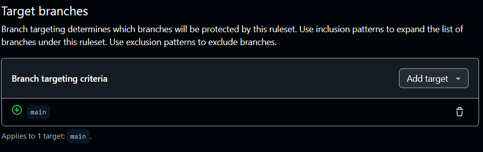
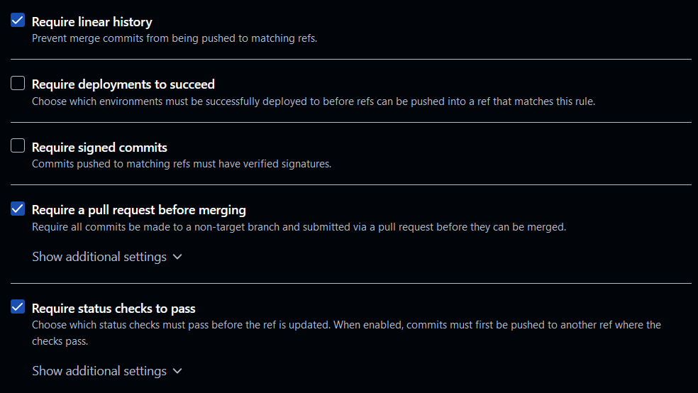

# Software Engineering Checkpoint 1: Configure Github & Local IDE

**IMPORTANT:** You need to have the local IDE configuration working to be able to follow along in class or start on any subsequent assignments. If you run into trouble with that step and aren’t able to troubleshoot it yourself, stop, do not pass Go, do not collect $200, go directly to office hours (or email).

## General Info:

For this week's checkpoint, you'll be getting your repository ready to rock. This assignment will work a bit differently from later weeks, because you won't be writing much code, and the code you do write is just for this week.

## Part 1: Clone the Project repository

1. Follow the link in Brightspace to the starter code for the project; this will create a partially-configured repository for your project  
2. Invite your project buddies (either one or two people depending on your team size) as **Collaborators** under the 'Settings' tab

## Part 2: Configure checkstyle status checks

The default setup comes with a very bare-bones checkstyle setup, composed of a yml file (pronounced YEAH-mul) in .github/workflows, and an XML (pronounced 'EX-em-el') configuration file in the root directory.

1. Decide on **at least one** additional checkstyle rule. The Google checks ([https://github.com/checkstyle/checkstyle/blob/master/src/main/resources/google\_checks.xml](https://github.com/checkstyle/checkstyle/blob/master/src/main/resources/google_checks.xml)) can be a good place to start for brainstorming some ideas (many of those are already in the minimal set that's provided, but there are plenty that aren't). Feel free to customize/make your own rules, too\!  
2. Add the rule(s) from 1 to checkstyle\_checks.xml in your repo. You may need to experiment or look at documentation to figure out the formatting here - learning how to navigate unfamiliar systems is an important part of software engineering.  
   

Feel free to customize the Github Actions file\! The default is console output from an Ubunto vm, but there are some fun open source options to make the output prettier/more configurable (like reviewdog). Experimenting with the file is **optional**, the default file is fine if you prefer. **Important:** if your changes result in something other than **exactly two** status checks, talk to Katherine about how to get the checkpoint tests to pass.

## Part 3: Set up Branch Protection

**Caution**: You'll want at least one feature branch with a pull request before completing this step, otherwise you'll run into trouble with step 4. Completing part 2 will work for this step, but if you're working through steps out-of-order, you can also make a simple edit to the README - you just need the status checks to have run once in your repo.

1. Under 'Settings' \> 'Rules' (In the ‘Code & Automation’ section), create a new Ruleset that will protect the main branch.  
2. Specify the branch 'main' under the 'Target branches' section. After you've specified the branch, there should be a small label at the bottom of the block that says 'Applies to 1 target'. If it says 'Applies to 0 targets', you'll need to update your branch targeting condition.

3. Set up the **3 top-level** restrictions: Require linear history, Require a pull request, and Require status checks  

4.  Choose the status checks: Gradle and Checkstyle. Make sure you're picking existing status checks \- Github will happily let you add a "status check" that doesn't actually correspond to anything, but if you type something like 'Gra' and 'Gradle' pops up, selecting that will wire things up correctly. The check should reference that it's from Github Actions if you've done this correctly:
   

   

## Part 4: Create a Local Checkout 

1. Install Github Desktop (or your preferred git client)
2. Log in as your github user, and **clone** the project repository; this will create a folder on your computer (usually under Documents \> Github \> \<Name of Repo\>). If prompted, you are using this repo **for your own purposes**, not to contribute back.
3. Choose a name for your project, and add it to the build.gradle file where it says 'FillThisIn'  
4. Set up the Eclipse metadata: Open a terminal/command line window, navigate to the project repository, and run gradlew eclipse (./gradlew on Mac, gradlew.bat on Windows 10, gradlew on Windows 11). On a Mac, if you get a permissions error, run chmod a+rwx gradlew to re-add the executable permission to the shell script  
5. Open Eclipse, and choose File \> Import \> General \> Existing Projects Into Workspace. Navigate to your project folder, and select it. Now you can create code that will automatically sync with Github Desktop (which will slightly less automatically sync with Github) **Caution:** if you add the project as a Gradle project rather than an existing project after running step 3, this will appear to work but cause subtle errors later

## Part 5: Trust but Verify; Test your setup

The initial configuration for your project should prevent you from **merging** any code that doesn't pass a set of **status checks**: these will verify style conventions, that the code compiles, and that it passes tests. But how do you know if these status checks are working properly? Anytime you're interacting with a new system, you want to verify two things: that it breaks when you expect it to break, and that it works when you expect it to work. Put another way, the most common way to **misconfigure the status checks** is to have them always passing, even when the code doesn't compile. This part of the assignment lets you verify that everything is configured correctly:

1. Create a **feature branch** in your local checkout  
2. Create an 'src' folder with a **file** with some Java code that should **fail both checkstyle and gradle (compile)** status checks. It can be anything \- Hello World, a prime number generator, etc. You won't be using this in your project, it's just to test your configuration.  
3. Commit the file to your branch  
4. Create a **Pull Request** to merge the feature branch into main  
5. Verify that **both** status checks **fail**  
   1. This is very important. One of the easiest ways to have your repo misconfigured is to have Github rubber-stamping Pull Requests rather than running checks. The only way to verify that everything is working correctly is to get a status check failure.  
6. Fix the **problems** with the Java code, and make a second commit to your feature branch  
7. Verify that the status checks now **pass**  
   1. Remember, you must get a failure and then a success with the same checkstyle yml and xml; if you have to fix bugs at any point, that's fine, but make sure to re-run all of steps 4-6  
8. Have each of your buddies open the Pull Request and **approve** it  
9. There's no need to actually merge things at this point, but you should verify that you have a green button to do so.

**Part 6: Checkpoint Tests and Submitting the Checkpoint**

1. Commit the Checkpoint1TestSuite from Brightspace into a 'test' folder in your repo
2. Merge that test into your main branch. In order to do so, all the tests will need to pass. See 'Checkpoints Overview' under the 'Project Resources' module on Brightspace for more details  
3. On Brightspace, for Checkpoint 1, submit a link to the latest commit on your main branch \- this allows you to make later changes to your project (such as starting to work on checkpoint 2) without affecting your checkpoint submission.
