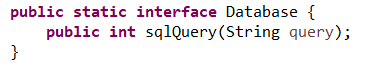
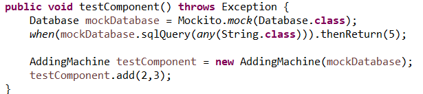
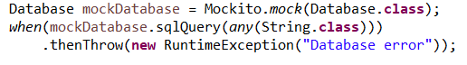
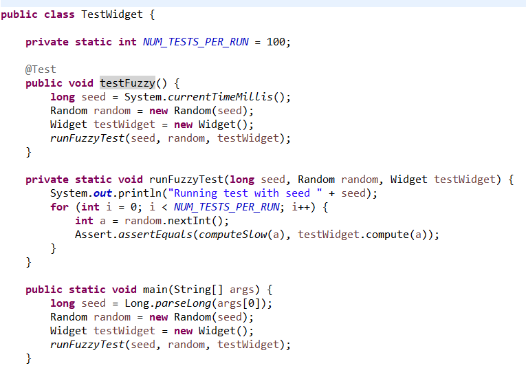

# Testing & Debugging

---

# Software Engineering

### Testing


---

<style scoped>
section {
  font-size: 23px;
 
}
</style>

# Testing Software

If it's not tested, it doesn't work: Bugs can happen anywhere

Many types of testing\, highest level division is:

**Manual**  testing: an actual person fires everything up and starts using it

- **Usability testing**: How easy is it for a user to use the system? 
- **Exploratory testing**: A tester uses the system in unexpected ways to find bugs
- **Visual testing** (can be automated, but expensive)

**Automated**  testing: software runs through a suite of programmed tests

- **Regression testing**: Make sure that new code doesn't break old code
- **Unit testing**: Test a single component.
- **Integration testing**: Make sure that multiple components work together correctly
- **Failure testing**: Make sure that the system behaves correctly when a component fails
- **Performance testing**: Make sure that the system behaves correctly under load


---

<style scoped>
section {
  font-size: 25px;
 
}
</style>

# Regression Tests

Most common type of test

Three main categories:

**Unit tests:** Test a single component (one API); often use  **mocks** to replace other components

- Ex: prototype tests

**Integration tests:** Test a combination of several components, but not necessarily user-visible endpoints

- Ex: Check that a server can work with an actual database

**End-to-end tests:** Start with a (simulated) user action, check the user-visible result, running through the whole system

- Ex: Run an install script and check that servers can start up after being installed

---

<style scoped>
section {
  font-size: 25px;
 
}
</style>


# Writing Tests: JUnit

To run a java program: Use a  **main**  method

To run a java test: Use an  **@Test**  annotation

```java
import static org.junit.jupiter.api.Assertions.fail;
import org.junit.jupiter.api.Test;

public class ExampleTest {
    @Test

    public void testAddition() {
        int a = 2;
        int b = 3;
        if (a + b != 5) {
            fail();
        }
    }
}
```

---

<style scoped>
section {
  font-size: 22px;
 
}
</style>

# Writing Tests: JUnit

```java
import static org.junit.jupiter.api.Assertions.fail;
import org.junit.jupiter.api.Test;

public class ExampleTest {
    @Test

    public void testAddition() {
        int a = 2;
        int b = 3;
        if (a + b != 5) {
            fail();
        }
    }
}
```

### Key Concepts

* **`import static`**: Allows direct access to static methods or constants (like `fail()`) without prefixing them with their class name (e.g., `Assertions.fail()`).
* **`static`**: Indicates that a method or variable belongs to the class itself, rather than to a specific instance (object) of that class.

---

# Writing Tests: JUnit

```java
import static org.junit.jupiter.api.Assertions.fail;
import org.junit.jupiter.api.Test;

public class ExampleTest {
    @Test

    public void testAddition() {
        int a = 2;
        int b = 3;
        if (a + b != 5) {
            fail();
        }
    }
}
```

*Note*:  JUnit 4 vs JUnit 5: to use the more up-to-date/widely supported version, make sure to import org.junit.jupiter, not regular org.junit

---

<span style="color:#0000ff">import</span>  __ static org\.junit\.jupiter\.api\.Assertions\.fail;__

<span style="color:#0000ff">import</span>  __ org\.junit\.jupiter\.api\.Test;__

<span style="color:#0000ff">public</span>  __ __  <span style="color:#0000ff">class</span>  __ __  <span style="color:#2b91af">ExampleTest</span>  __ \{__

__    @Test__

__    __  <span style="color:#0000ff">public</span>  __ __  <span style="color:#2b91af">void</span>  __ testAddition\(\) \{__

__        __  <span style="color:#2b91af">int</span>  __ a = 2;__

__        __  <span style="color:#2b91af">int</span>  __ b = 3;__

__        __  <span style="color:#0000ff">if</span>  __ \(a \+ b \!= 5\) \{__

__            fail\(\);__

__        \}__

__  \}__

__\}__

__JUnit is a heavily __  __annotation\-based__  __ framework \- __  __@Test__  __ is the most common\, but there are others \(ex: @BeforeEach\)__

<span style="color:#0000ff">import</span>  __ static org\.junit\.jupiter\.api\.Assertions\.fail;__

<span style="color:#0000ff">import</span>  __ org\.junit\.jupiter\.api\.Test;__

<span style="color:#0000ff">public</span>  __ __  <span style="color:#0000ff">class</span>  __ __  <span style="color:#2b91af">ExampleTest</span>  __ \{__

__    @Test__

__    __  <span style="color:#0000ff">public</span>  __ __  <span style="color:#2b91af">void</span>  __ testAddition\(\) \{__

__        __  <span style="color:#2b91af">int</span>  __ a = 2;__

__        __  <span style="color:#2b91af">int</span>  __ b = 3;__

__        __  <span style="color:#0000ff">if</span>  __ \(a \+ b \!= 5\) \{__

__            fail\(\);__

__        \}__

__  \}__

__\}__

__When a test class runs\, it will run all methods with @Test as separate tests\.__

__A test __  __fails __  __if it throws an Exception\, Error or other Throwable \(fail\(\) throws an AssertionError\)\. Otherwise\, it succeeds__

# Your Turn!

You'll want a project for following along for today\, so let's get that configured now

Follow the Testing Exercises link on Brightspace\, and open with Github Desktop \(or preferred git client\)

From the command line in the repo folder\, run \./gradlew eclipse

Copy the ExampleTest class from the previous slide into a new file in a test folder in your repo \(TestingExercises/test/ExampleTest\.java\)

Check that ExampleTest compiles and runs

Note: you may need to change the junit\-jupiter version in build\.gradle\, depending on what Eclipse version you have \- you can get Eclipse to tell you what it expects \(go through the steps of adding JUnit 5 as a library to your build path\, but  __don’t actually add it__ \, just grab the version info on the penultimate step\)

# When To Use Which Type of Test

Remember the System Design Diagram from last week\.

Suppose you write all the code\, fire it up\, and the search bar doesn't do anything\.

What's broken?


# Unit Tests: Something is Wrong Inside a Box

Recall: a  __unit test__  tests just one component

If something is wrong with  __just__  the search bar\, a unit test for the search bar will fail


# Integration Tests: Something is Wrong Between Boxes

Recall: an  __integration test__  tests multiple components \(usually 2\)

If something is wrong with sending a parsed query to the indexed data\, that will cause an  __integration test__  to fail


# End-To-End Tests: Something is Wrong Systematically

Recall: an  __end\-to\-end test__  checks an entire workflow

If all integration and unit tests are passing\, an end\-to\-end failure will flag systemic issues \(ex: SSL configuration mismatch\)


# Unit Tests: Just What's in One Box?

How to test that 'search results display correctly' while  __only__  using code from the 'Search Bar' component?


# Mock Objects

In order to isolate just one component for testing\, use  __mock objects__  for other components

In\-memory

Dummy implementation \(hardcoded return values for methods\)

No side effects

Test\-code only \(often single\-test only\)


<span style="color:#0000ff">import</span>  __ org\.mockito\.Mockito;__

<span style="color:#0000ff">import</span>  __ static org\.mockito\.Mockito\.when;__

<span style="color:#0000ff">import</span>  __ static org\.mockito\.Mockito\.any;__

Common Framework: Mockito

Many other interesting methods that you can statically import\!

__Note__ : Most IDEs don't have good support for automatic static import detection; you may need to do this part by hand

Creating the mock object: Mockito\.mock\(\)

Interfaces

Non\-final classes


Dummy implementation: tell the mock how it should respond to requests

Anything left unspecified will return default values and do nothing






Use the mock to create a  __real version __ of the component to test

Everything else except that one component is mocked


# Your Turn!

Look at the exercise1 package in the TestingExercises project

Within that\, you'll find a class Widget and an interface Foo

Write a test for the Widget class that uses a mock Foo object\, and verifies that calling addNumbers\(2\,3\) does not throw an Exception

# To the IDE!

# Internet Advice Caution

Mockito\.verify is often recommended \(including in Mockito docs\) online; don't use this for unit tests/smoke tests

Annoying to configure

Encourages bad testing practices \(change\-detection tests vs behavior tests\)

Good for some highly specific use cases \(in particular\, it’s good for convincing devs with established code bases to migrate to Mockito\)

Advantage of Mockito over other mock frameworks \(EasyMock\, JMock\) is that you can easily avoid calling verify

Look at the "stub method calls" examples instead

# JUnit Assertions

__ __  __  __  <span style="color:#7f0055"> __public__ </span>  __ __  <span style="color:#7f0055"> __void__ </span>  __ testAddition\(\) \{__

__       __  <span style="color:#7f0055"> __int__ </span>  __ __  <span style="color:#6a3e3e">result</span>  __ = __  <span style="color:#7f0055"> __new__ </span>  __ AddingMachine\(\)\.add\(2\,3\);__

__       Assertions\.assertEquals\(5\, __  <span style="color:#6a3e3e">result</span>  __\);__

__   \}__

__JUnit: test fails ⇔ test throws an Exception__

__Test logic: test fails ⇔ some condition is not met__

__Assertions __  __translates between the two: if the two values to assertEquals aren't equal\, throws AssertionFailedError__

__Many\, many methods available \(arrayEquals\, lessThan\, greaterThan\, etc\)__

__Version note: in Junit 4\, this class was called Assert\. You can almost always directly replace __  __Assert\.\<method>__  __ with __  __Assertions\.\<method>__  __ to convert to Junit 5__

# Test Driven Development (TDD)

Write tests as you go along:

Write the API \(the  __prototype __ will often be the first test\)

Write some simple unit and integration tests \( __smoke tests__ \)

Write the  __code__

Write  __bug\-driven__  tests \(unit and integration\)

__Remember__ : a good test always needs to fail at first


__Smoke tests__  \(where there's smoke there's fire\):

Specific type of  __unit test__

Check that all  __basic __ operations work for normal input

Does not need to handle  __edge cases __ or complex cases

Example:

<span style="color:#741b47">public void</span>  __ testAddition\(\) \{__

__   __  <span style="color:#741b47">int </span> result  __= __  <span style="color:#741b47">new </span>  __AddingMachine\(\)\.add\(2\,3\);__

__   __  __// old\-school alternative to Assertions__

__   __  <span style="color:#741b47">assert </span> result  __== 5; __

__\}__

# Failure Testing

Use tests to trigger unusual  __error __ states

File system failures

Networking failures

More generally\, any failure from another component's API


For simple cases\, use a  __mock__  object:

Mockito\.thenThrow



But what if you need something more fully featured than a mock?

Add  __testing hooks__  in your code

These are no\-op methods designed for tests to override them to inject functionality

Combine these with a  __test __ implementation

Fully functional \(unlike a mock\)

Allows for failure testing in  __integration__  tests


<span style="color:#741b47">public class</span>   __ServerConnection \{__

__    __  <span style="color:#741b47">public </span>  __Connection getConnection\(\) \{__

__	testingHook\(\);__

__	__  <span style="color:#741b47">return </span>  __connection;__

__    \}__

__    __  <span style="color:#741b47">protected void</span>  __ testingHook\(\) \{__

<span style="color:#38761d">// does nothing\, only implemented by tests</span>

__    \}__

__\}__

<span style="color:#741b47">public class</span>   __ServerTestSuite \{__

__  __  <span style="color:#741b47">private boolean</span>  __ __  <span style="color:#0000ff">hasFailed </span>  __= __  <span style="color:#741b47">false</span>  __;__

__  __  <span style="color:#741b47">private static class</span>  __ TestServerConnection __  <span style="color:#741b47">extends </span>  __ServerConnection \{__

__     __  <span style="color:#741b47">protected void</span>  __ testingHook\(\) \{__

__       __  <span style="color:#741b47">if </span>  __\(\!__  <span style="color:#0000ff">hasFailed</span>  __\) \{__

__         __  <span style="color:#0000ff">hasFailed </span>  __= __  <span style="color:#741b47">true</span>  __;__

__         __  <span style="color:#741b47">throw new</span>  __ ServerConnectionException\(\);__

__       \}__

__    \}__

__\}__

# Bug-Driven Testing

Use tests to reproduce a bug in a controlled environment


Happens  __after__  implementing code

Either actual reported bugs\, or suspected bugs:

Edge cases

Unusual code paths

Combine with TDD smoke tests to get good  __testing coverage__

# Testing Coverage

__Test Coverage __ is the percentage of branches and lines of code that are exercised by test code

Ideally\, all lines of code would be tested; in practice\, that's often excessive/not useful

Ex: an assert statement that never fails

Aim for  __80\-90%__  code coverage

# Testing Coverage Tools


* __Recommended: __ JaCoCo \( _[https://www\.eclemma\.org/jacoco/](https://www.eclemma.org/jacoco/)_ \)
* Originated from the Emma project \( _[https://emma\.sourceforge\.net/](https://emma.sourceforge.net/)_ \)\, which is no longer well\-maintained
* Includes IDE plugins for both IntelliJ and Eclipse
  * _[https://plugins\.jetbrains\.com/plugin/103\-emma\-code\-coverage](https://plugins.jetbrains.com/plugin/103-emma-code-coverage)_
  * _[https://www\.eclemma\.org/](https://www.eclemma.org/)_


# Testing Coverage

Sample Coverage Output

__@Test__

<span style="color:#7f0055"> __public__ </span>  __ __  <span style="color:#7f0055"> __void__ </span>  __ testAddition\(\) \{__

__  __  <span style="color:#7f0055"> __int__ </span>  __ __  <span style="color:#6a3e3e">result</span>  __ = __  <span style="color:#7f0055"> __new__ </span>  __ AddingMachine\(\)\.add\(2\,3\);__

__  Assertions\.assertEquals\(5\, __  <span style="color:#6a3e3e">result</span>  __\);__

__\}__


# Using Test Coverage Output

80% coverage is fine

Focus on quality of tests more than coverage numbers

Use the output to spot problem areas/missing testing


# Fuzz Testing

A version of automated  __exploratory__  testing

Uses randomization to test out unexpected paths

Randomization in tests must be done carefully\, or the tests stop

being useful:

For each test run\, print the  __seed__  used for the random number generator

Allow a  __manual __ run to specify a seed

This lets you have  __repeatable __ tests\, which is critical for identifying and fixing bugs


# Fuzz Testing Example



# Your Turn!

Check out the exercise2 package in TestingExercises

Run the tests\, check that the basic  __smoke test__  passes

Using the checkComputation method\, write a fuzzy test that will add lots of different random integers

Using the fuzzy test\, find an input that triggers the bug in AddingMachine\.java

# Software Engineering

# Debugging


# Debugging Philosophy


Quick iteration is key

Prefer  __many__  tests that each check one small feature

Code complexity is  __quadratic __ with lines of code

Finding a bug is a  __search__  problem

# Design for Debugability


* Keep state as local as possible
  * Local variables
  * Parameters
  * Private data
  * Public data


Make shared data immutable wherever possible

Example: Builder pattern

__WidgetBuilder __ newWidget =  <span style="color:#741b47">new </span>  __WidgetBuilder\(\);__

__   	__ newWidget __\.setSpinnerSpeed\(getSpinnerSpeed\(\)\);__

__   	__ newWidget __\.setNumberOfGears\(numGears\);__

__   	__  <span style="color:#741b47">return </span> newWidget __\.build\(\);__

Create wrapper classes to keep code logic in one file

<span style="color:#741b47">public class</span>  __ WidgetCache \{__

__   		 __  <span style="color:#741b47">private </span>  __Map\<Long\, Widget> __  <span style="color:#0000ff">idToWidgetCache </span>  __= __  <span style="color:#741b47">new </span>  __HashMap<>\(\);__

__   		 __  <span style="color:#741b47">public </span>  __Widget put\(long id\, Widget widget\) \{__

__   		__  <span style="color:#0000ff">	 </span>  <span style="color:#741b47">return </span>  <span style="color:#0000ff">idToWidgetCache</span>  __\.put\(id\, widget\);__

__   		 \}__

__ __  <span style="color:#741b47">public </span>  __Widget get\(long id\) \{__

<span style="color:#741b47">return </span>  <span style="color:#0000ff">idToWidgetCache</span>  __\.get\(id\);__

__ \}__

__   		 __  <span style="color:#741b47">public void </span>  __clear\(\) \{__

__   			 __  <span style="color:#0000ff">idToWidgetCache</span>  __\.clear\(\);__

__   		 \}__

__   	 \}__

# Useful IDE Tools

Breakpoints


Conditional Breakpoints


Control Flow: Step in/out/over


Tons of useful info available in the debugger

Much faster to examine live vs\. println debugging


Drop To Frame \(Caution: Does not reset  __non\-local__  state\, such as fields\)


# Debugging Example


Build a smoke test first

<span style="color:#7f0055"> __public__ </span>  __ __  <span style="color:#7f0055"> __class__ </span>  __ WrappedHashMap \{__

__	__  <span style="color:#7f0055"> __private__ </span>  __ Map\<Integer\, String> __  <span style="color:#0000c0">data</span>  __;__

__	__  <span style="color:#7f0055"> __private__ </span>  __ __  <span style="color:#7f0055"> __boolean__ </span>  __ __  <span style="color:#0000c0">needToInitialize</span>  __;__

__	__  <span style="color:#7f0055"> __public__ </span>  __ String get\(__  <span style="color:#7f0055"> __int__ </span>  __ __  <span style="color:#6a3e3e">id</span>  __\) \{__

__		__  <span style="color:#7f0055"> __if__ </span>  __ \(__  <span style="color:#0000c0">needToInitialize</span>  __\) \{__

__			initalize\(\);__

__			__  <span style="color:#0000c0">needToInitialize</span>  __ = __  <span style="color:#7f0055"> __false__ </span>  __;__

__		\}__

__		__  <span style="color:#7f0055"> __return__ </span>  __ __  <span style="color:#0000c0">data</span>  __\.get\(__  <span style="color:#6a3e3e">id</span>  __\);__

__	\}__

__	__  <span style="color:#7f0055"> __public__ </span>  __ __  <span style="color:#7f0055"> __void__ </span>  __ put\(__  <span style="color:#7f0055"> __int__ </span>  __ __  <span style="color:#6a3e3e">id</span>  __\, String __  <span style="color:#6a3e3e">value</span>  __\) \{__

__		__  <span style="color:#7f0055"> __if__ </span>  __ \(__  <span style="color:#0000c0">needToInitialize</span>  __\) \{__

__			initalize\(\);__

__			__  <span style="color:#0000c0">needToInitialize</span>  __ = __  <span style="color:#7f0055"> __false__ </span>  __;__

__		\}__

__		__  <span style="color:#0000c0">data</span>  __\.put\(__  <span style="color:#6a3e3e">id</span>  __\, __  <span style="color:#6a3e3e">value</span>  __\);__

__	\}__

__	__  <span style="color:#7f0055"> __private__ </span>  __ __  <span style="color:#7f0055"> __void__ </span>  __ initalize\(\) \{__

__		__  <span style="color:#7f0055"> __int__ </span>  __ __  <span style="color:#6a3e3e">initialCapacity</span>  __ = 10;__

__		__  <span style="color:#0000c0">data</span>  __ = __  <span style="color:#7f0055"> __new__ </span>  __ HashMap<>\(__  <span style="color:#6a3e3e">initialCapacity</span>  __\);__

__	\}__

__\}__

Next\, write the implementation

We're leaving the cross\-component db call unimplemented for the moment

Because we'll have that eventually\, though\, we need to use  __lazy initialization__

Note that you should never rely on a user to initialize\!

To the debugger\!

Recap of the process:

Put a breakpoint on the failing line

Run through a test that triggers the failure\, and check instance and local variable state at the breakpoint

Add a breakpoint where the value of an incorrect variable should have changed

Repeat

# Your Turn!

Check out the exercise3 package in TestingExercises

Run the TestCombinatorics test; it should fail

Put a breakpoint at the last line in the stack trace\, and see what variables are invalid at that line

Find where the invalid variable should have been set\, put another breakpoint there \(for method return values\, use the 'return' line of the method\)

Repeat this process \- for breakpoints within for loops\, use a conditional breakpoint to only stop the breakpoint when something interesting is happening

Fix the bug\, and verify the test is now green

# Let's Review (Testing & Debugging)

Two main  __categories __ of testing: manual vs automated\, what each is good for

Three types of  __regression__  testing

What is a  __mock__  object and what is it used for

What is a  __testing hook__  and what is it used for

What is  __fuzz testing__  \(\.\.\.and what is it used for\)

What are three ways to  __design for debugability __ in your code

