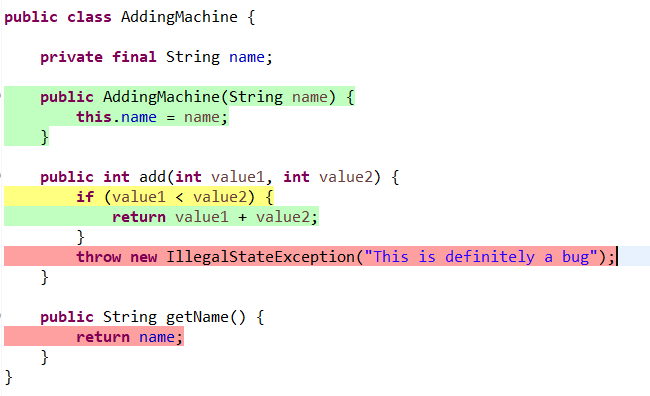
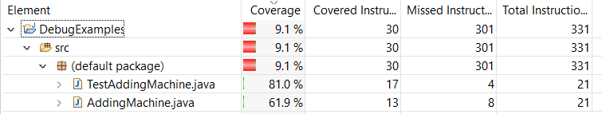
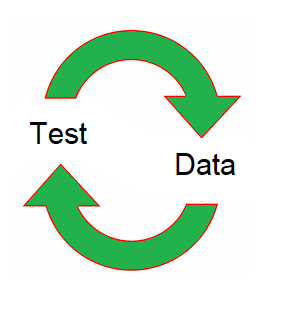
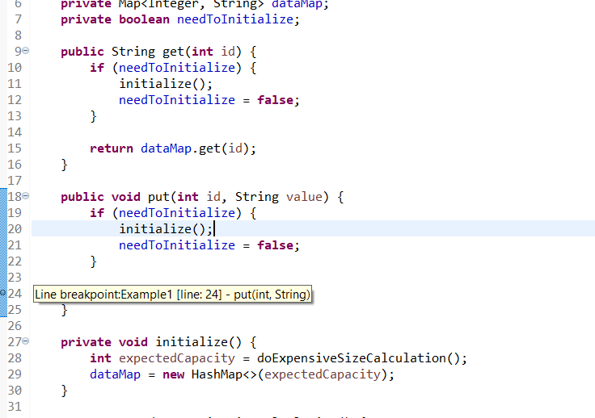
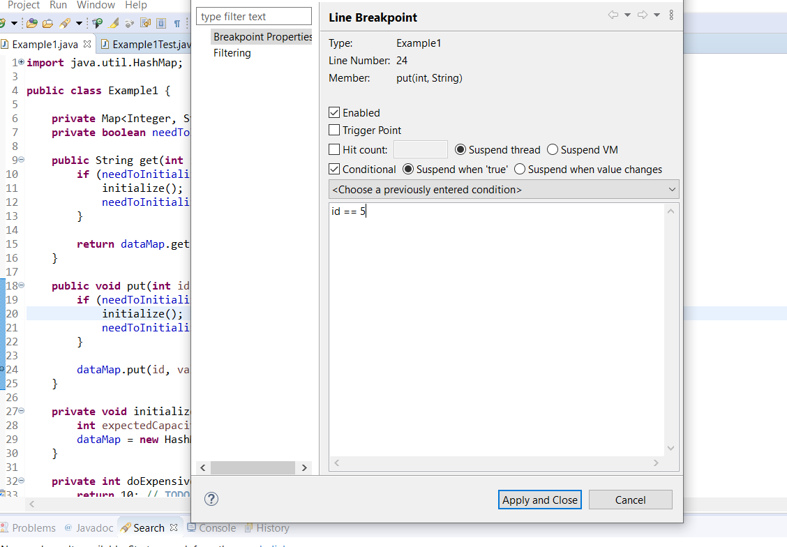
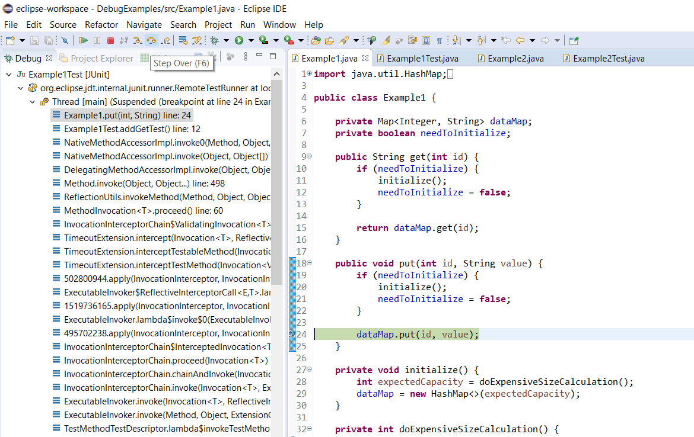
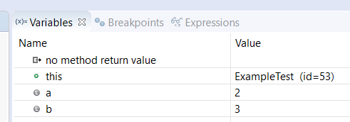
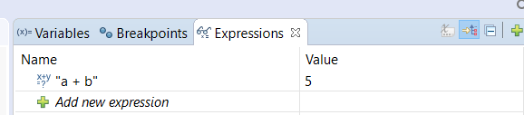
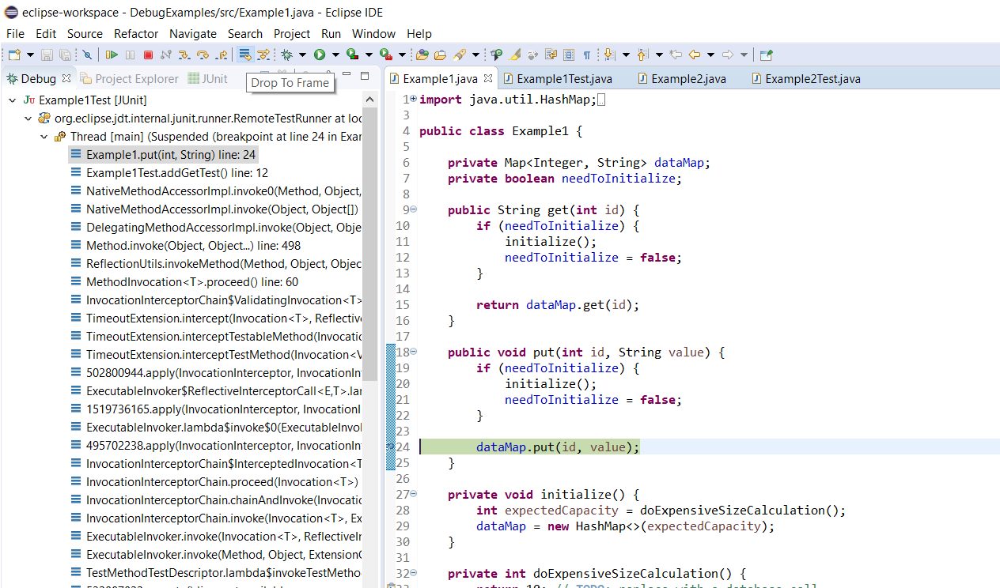
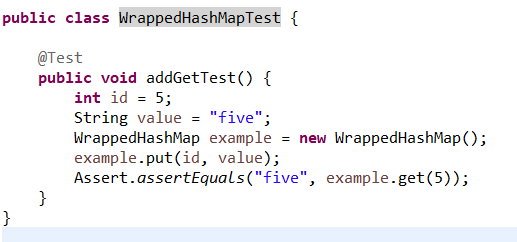

# Testing & Debugging

---

# Software Engineering

### Testing


---

<style scoped>
section {
  font-size: 23px;
 
}
</style>

# Testing Software

If it's not tested, it doesn't work: Bugs can happen anywhere

Many types of testing\, highest level division is:

**Manual**  testing: an actual person fires everything up and starts using it

- **Usability testing**: How easy is it for a user to use the system? 
- **Exploratory testing**: A tester uses the system in unexpected ways to find bugs
- **Visual testing** (can be automated, but expensive)

**Automated**  testing: software runs through a suite of programmed tests

- **Regression testing**: Make sure that new code doesn't break old code
- **Unit testing**: Test a single component.
- **Integration testing**: Make sure that multiple components work together correctly
- **Failure testing**: Make sure that the system behaves correctly when a component fails
- **Performance testing**: Make sure that the system behaves correctly under load


---

<style scoped>
section {
  font-size: 25px;
 
}
</style>

# Regression Tests

Most common type of test

Three main categories:

**Unit tests:** Test a single component (one API); often use  **mocks** to replace other components

- Ex: prototype tests

**Integration tests:** Test a combination of several components, but not necessarily user-visible endpoints

- Ex: Check that a server can work with an actual database

**End-to-end tests:** Start with a (simulated) user action, check the user-visible result, running through the whole system

- Ex: Run an install script and check that servers can start up after being installed

---

<style scoped>
section {
  font-size: 25px;
 
}
</style>


# Writing Tests: JUnit

To run a java program: Use a  **main**  method

To run a java test: Use an  **@Test**  annotation

```java
import static org.junit.jupiter.api.Assertions.fail;
import org.junit.jupiter.api.Test;

public class ExampleTest {
    @Test

    public void testAddition() {
        int a = 2;
        int b = 3;
        if (a + b != 5) {
            fail();
        }
    }
}
```

---

<style scoped>
section {
  font-size: 22px;
 
}
</style>

# Writing Tests: JUnit

```java
import static org.junit.jupiter.api.Assertions.fail;
import org.junit.jupiter.api.Test;

public class ExampleTest {
    @Test

    public void testAddition() {
        int a = 2;
        int b = 3;
        if (a + b != 5) {
            fail();
        }
    }
}
```

### Key Concepts

* **`import static`**: Allows direct access to static methods or constants (like `fail()`) without prefixing them with their class name (e.g., `Assertions.fail()`).
* **`static`**: Indicates that a method or variable belongs to the class itself, rather than to a specific instance (object) of that class.

---

# Writing Tests: JUnit

```java
import static org.junit.jupiter.api.Assertions.fail;
import org.junit.jupiter.api.Test;

public class ExampleTest {
    @Test

    public void testAddition() {
        int a = 2;
        int b = 3;
        if (a + b != 5) {
            fail();
        }
    }
}
```

*Note*:  JUnit 4 vs JUnit 5: to use the more up-to-date/widely supported version, make sure to import org.junit.jupiter, not regular org.junit

---
<style scoped>
section {
  font-size: 25px;
 
}
</style>

# Writing Tests: JUnit

```java
import static org.junit.jupiter.api.Assertions.fail;
import org.junit.jupiter.api.Test;

public class ExampleTest {
    @Test

    public void testAddition() {
        int a = 2;
        int b = 3;
        if (a + b != 5) {
            fail();
        }
    }
}
```


JUnit is a heavily **annotation-based** framework - **@Test** is the most common, but there are others (ex: @BeforeEach)

---
<style scoped>
section {
  font-size: 25px;
 
}
</style>

# Writing Tests: JUnit

```java
import static org.junit.jupiter.api.Assertions.fail;
import org.junit.jupiter.api.Test;

public class ExampleTest {
    @Test

    public void testAddition() {
        int a = 2;
        int b = 3;
        if (a + b != 5) {
            fail();
        }
    }
}
```
When a test class runs, it will run all methods with @Test as separate tests.

A test **fails** if it throws an Exception, Error or other Throwable (fail() throws an AssertionError). Otherwise, it succeeds.

---

<style scoped>
section {
  font-size: 25px;
 
}
</style>

# Your Turn!

You'll want a project for following along for today\, so let's get that configured now

1. Follow the Testing Exercises link on Brightspace\, and open with Github Desktop \(or preferred git client\)

2. From the command line in the repo folder\, run \./gradlew eclipse

3. Copy the ExampleTest class from the previous slide into a new file in a test folder in your repo \(TestingExercises/test/ExampleTest\.java\)

4. Check that ExampleTest compiles and runs

Note: you may need to change the junit\-jupiter version in build\.gradle\, depending on what Eclipse version you have \- you can get Eclipse to tell you what it expects \(go through the steps of adding JUnit 5 as a library to your build path\, but  __don’t actually add it__ \, just grab the version info on the penultimate step\)

---

# When To Use Which Type of Test

Remember the System Design Diagram.

Suppose you write all the code, fire it up, and the search bar doesn't do anything.

What's broken?


---

# Unit Tests: Something is Wrong Inside a Box

Recall: an **unit test** tests just one component

If something is wrong with **just** the search bar, a unit test for the search bar will fail


---

# Integration Tests: Something is Wrong Between Boxes

Recall: an **integration test** tests multiple components (usually 2)

If something is wrong with sending a parsed query to the indexed data, that will cause an **integration test** to fail


---

# End-To-End Tests: Something is Wrong Systematically

Recall: an **end-to-end test** checks an entire workflow

If all integration and unit tests are passing, an **end-to-end failure** will flag systemic issues (ex: SSL configuration mismatch)


---

# Unit Tests: Just What's in One Box?

How to test that 'search results display correctly' while  **only**  **using code from the 'Search Bar' component?**


---

# Mock Objects

In order to isolate just one component for testing, use **mock objects** for other components

- **In-memory**

- **Dummy implementation** (hardcoded return values for methods)

- **No side effects**

- **Test-code only** (often single-test only)

```java
int getRandomNumber() {
    return 42; // Chosen by fair dice roll. Guaranteed to be random ;)
}
```

---

# Mock Objects

```java
import org.mockito.Mockito;
import static org.mockito.Mockito.when;
import static org.mockito.Mockito.any;
```

Common Framework: Mockito

- **when**: Specify what the mock should return for a given method call
- **any**: Match any argument for a method call

Many other interesting methods that you can statically import!

**Note**: Most IDEs don't have good support for automatic static import detection; you may need to do this part by hand

---

<style scoped>
section {
  font-size: 25px;
 
}
</style>

# Mock Objects

Creating the mock object: Mockito.mock()

- Interfaces: Can be mocked directly
- Non-final classes: Can be mocked directly

```java
public void testComponent() throws Exception {
    Database mockDatabase = Mockito.mock(Database.class); // Create a mock Database object
    when(mockDatabase.sqlQuery(any(String.class))).thenReturn(5);

    AddingMachine testComponent = new AddingMachine(mockDatabase);
    testComponent.add(2, 3);
}
```

---

# Mock Objects

Dummy implementation: tell the mock how it should respond to requests
- Anthing left unspecified will return default values and do nothing

```java
public static interface Database {
    public int sqlQuery(String query);
}
```

```java
public void testComponent() throws Exception {
    Database mockDatabase = Mockito.mock(Database.class);
    when(mockDatabase.sqlQuery(any(String.class))).thenReturn(5); //How should the mock respond to sqlQuery? Rreturn 5

    AddingMachine testComponent = new AddingMachine(mockDatabase);
    testComponent.add(2, 3);
}
```


---

# Mock Objects

Use the mock to create a  **real version** of the component to test

Everything else except that one component is mocked

```java
public void testComponent() throws Exception {
    Database mockDatabase = Mockito.mock(Database.class);
    when(mockDatabase.sqlQuery(any(String.class))).thenReturn(5);

    AddingMachine testComponent = new AddingMachine(mockDatabase); // The AddingMachine is a real object
    testComponent.add(2, 3);
}
```


---

# Your Turn!

1. Look at the exercise package in the TestingExercises project

2. Within that, you'll find a class Widget and an interface Foo

3. Write a test for the Widget class that uses a mock Foo object, and verifies that calling addNumbers(2,3) does not throw an Exception

---

# To the IDE!

---

# Internet Advice Caution

Mockito.verify is often recommended (including in Mockito docs) online; don't use this for unit tests/smoke tests

- Annoying to configure

- Encourages bad testing practices (change-detection tests vs behavior tests)

- Good for some highly specific use cases \(in particular\, it’s good for convincing devs with established code bases to migrate to Mockito\)

Advantage of Mockito over other mock frameworks \(EasyMock\, JMock\) is that you can easily avoid calling verify

- Look at the "stub method calls" examples instead

---

<style scoped>
section {
  font-size: 25px;
 
}
</style>


# JUnit Assertions

```java

public void testAddition(){
  int result = new AddingMachine().add(2,3);
  Assertions.assertEquals(5, result);
}

```

JUnit: test fails ⇔ test throws an Exception

Test logic: test fails ⇔ some condition is not met

Assertions translates between the two: if the two values to assertEquals aren't equal, throws AssertionFailedError.

- Many\, many methods available (arrayEquals, lessThan, greaterThan, etc)

Version note: in Junit 4, this class was called Assert. You can almost always directly replace Assert.<method> with Assertions.<method> to convert to Junit 5.

---

# Test Driven Development (TDD)

Write tests as you go along:

- Write the API (the **prototype** will often be the first test\

- Write some simple unit and integration tests (**smoke tests**)

- Write the **code**

- Write **bug-driven** tests (unit and integration)

**Remember** : a good test always needs to fail at first

---

# Test Driven Development (TDD)


**Smoke tests** (where there's smoke there's fire):

- Specific type of **unit test**.

- Check that all **basic** operations work for normal input.

- Does not need to handle **edge cases** or complex cases.

Example:

```java
public void testAddition(){
  int result = nw AddingMachine().add(2,3);

  //old-school alternative to Assertions
  assert result = 5;
}
```

---

# Failure Testing

Use tests to trigger unusual **error** states.

- File system failures
- Networking failures
- More generally, any failure from another component's API


---

# Failure Testing

For simple cases, use a **mock** object:

Mockito.thenThrow

```java
Database mockDatabase = Mockito.mock(Database.class);
when(mockDatabase.sqlQuery(any(String.class)))
  .thenThrow(new RuntimeException("Database error"))
```


---

<style scoped>
section {
  font-size: 26px;
 
}
</style>

# Failure Testing

But what if you need something more fully featured than a mock?

Add **testing hooks** in your code

- These are no-op methods designed for tests to override them to inject functionality

Combine these with a **test** implementation

- Fully functional (unlike a mock)
- Allows for failure testing in **integration** tests.


---

# Failure Testing

<style scoped>
section {
  font-size: 23px;
 
}
</style>

```java
public class ServerConnection {
  public Connection getConnection() {
    testingHook();
    return connection;
  }

  protected void testingHook() {
    //does nothing, only implemented by tests
  }
}

public class ServertestSuite {
  private boolean hasFailed = false;

  private static class TestServerConnection extends ServerConnection {
    protected void testingHook() {
      if(!hasFailed) {
        hasFailed = true;
        throw new ServerConnectionExeption();
      }
  }
}
```


---

# Bug-Driven Testing

Use tests to reproduce a bug in a controlled environment


---

# Bug-Driven Testing

Happens **after** implementing code

Either actual reported bugs, or suspected bugs:

- Edge cases
- Unusual code paths

Combine with TDD smoke tests to get good **testing coverage**

---

# Testing Coverage

**Test Coverage** is the percentage of branches and lines of code that are exercised by test code

Ideally, all lines of code would be tested; in practice, that's often excessive/not useful

Ex: an assert statement that never fails

Aim for  **80-90%**  code coverage

----

# Testing Coverage Tools


**Recommended:** JaCoCo \( _[https://www\.eclemma\.org/jacoco/](https://www.eclemma.org/jacoco/)_ \)
- Originated from the Emma project \( _[https://emma\.sourceforge\.net/](https://emma.sourceforge.net/)_ \)\, which is no longer well\-maintained
- Includes IDE plugins for both IntelliJ and Eclipse
  - _[https://plugins\.jetbrains\.com/plugin/103\-emma\-code\-coverage](https://plugins.jetbrains.com/plugin/103-emma-code-coverage)_
  - _[https://www\.eclemma\.org/](https://www.eclemma.org/)_


---

# Testing Coverage

Sample Coverage Output

```java
@Test
public void testAddition() {
  int result = new AddingMachine().add(2,3);
  Assertions.assertEquals(5, result);
}
```





---

# Using Test Coverage Output

80% coverage is fine

Focus on quality of tests more than coverage numbers

Use the output to spot problem areas/missing testing


---

# Fuzz Testing

A version of automated **exploratory** testing

Uses randomization to test out unexpected paths

Randomization in tests must be done carefully, or the tests stop being useful:

- For each test run, print the **seed** used for the random number generator

- Allow a **manual** run to specify a seed

This lets you have **repeatable** tests, which is critical for identifying and fixing bugs


---

# Fuzz Testing Example

<style scoped>
section {
  font-size: 20px;
 
}
</style>

```java
public class TestWidget {

  private static int NUM_TEST_PER_RUN = 100;

  @Test
  public void testFuzzey() {
    long seed = System.currentTimeMillis();
    Random rand = new Random(seed);
    Widget testWidget = new Widget();
    runFuzzytest(seed, random, testWidget);
  }

  private static void runFuzzyTest(long seed, Random rand, Widget testWidget) {
    System.out.println("Running fuzzy test with seed: " + seed);
    for (int i = 0; i < NUM_TEST_PER_RUN; i++) {
      int a = random.nextInt();
      Assert.assertEquals(computeSlow(a), testWidget.compute(a));
    }
  
  public static void main(String[] args) {
    long seed = Long.parseLong(args[0]);
    Random random = new Random(seed);
    Widget testWidget = new Widget();
    runFuzzyTest(seed, random, testWidget);
  }
}
```

---

# Your Turn!

Check out the exercise2 package in TestingExercises

Run the tests, check that the basic **smoke test** passes

Using the checkComputation method, write a fuzzy test that will add lots of different random integers

Using the fuzzy test, find an input that triggers the bug in AddingMachine\.java

---

# Software Engineering

### Debugging


---

# Debugging Philosophy

Quick iteration is key

Prefer **many** tests that each check one small feature

Code complexity is **quadratic** with lines of code

Finding a bug is a **search** problem



---

# Design for Debugability

* Keep state as local as possible
  * Local variables
  * Parameters
  * Private data
  * Public data


---

<style scoped>
section {
  font-size: 25px;
 
}
</style>

# Design for Debugability


Make shared data immutable wherever possible

Example: Builder pattern

```java
WidgetBuilder newWidget = new WidgetBuilder();
newWidget.setSpinnerSpeed(getSpinnerSpeed());
newWidget.setNumberOfGears(numGears);
return newWidget.build();
```

- **Guaranteed Immutability**: The constructed object (`Widget`) is completely read-only once instantiated, eliminating subtle state-mutation bugs across threads or methods.
- **Atomic Construction**: Prevents invalid or partially constructed objects from circulating in your system.
- **Easier Breakpoints**: You inspect parameter configuration during step-by-step construction, but runtime code only ever interacts with a stable, predictable object.

---

# Useful IDE Tools

Breakpoints



Conditional Breakpoints



Control Flow: Step in/out/over





Tons of useful info available in the debugger

Much faster to examine live vs\. println debugging



Drop To Frame \(Caution: Does not reset  __non\-local__  state\, such as fields\)



# Debugging Example



Build a smoke test first

<span style="color:#7f0055"> __public__ </span>  __ __  <span style="color:#7f0055"> __class__ </span>  __ WrappedHashMap \{__

__	__  <span style="color:#7f0055"> __private__ </span>  __ Map\<Integer\, String> __  <span style="color:#0000c0">data</span>  __;__

__	__  <span style="color:#7f0055"> __private__ </span>  __ __  <span style="color:#7f0055"> __boolean__ </span>  __ __  <span style="color:#0000c0">needToInitialize</span>  __;__

__	__  <span style="color:#7f0055"> __public__ </span>  __ String get\(__  <span style="color:#7f0055"> __int__ </span>  __ __  <span style="color:#6a3e3e">id</span>  __\) \{__

__		__  <span style="color:#7f0055"> __if__ </span>  __ \(__  <span style="color:#0000c0">needToInitialize</span>  __\) \{__

__			initalize\(\);__

__			__  <span style="color:#0000c0">needToInitialize</span>  __ = __  <span style="color:#7f0055"> __false__ </span>  __;__

__		\}__

__		__  <span style="color:#7f0055"> __return__ </span>  __ __  <span style="color:#0000c0">data</span>  __\.get\(__  <span style="color:#6a3e3e">id</span>  __\);__

__	\}__

__	__  <span style="color:#7f0055"> __public__ </span>  __ __  <span style="color:#7f0055"> __void__ </span>  __ put\(__  <span style="color:#7f0055"> __int__ </span>  __ __  <span style="color:#6a3e3e">id</span>  __\, String __  <span style="color:#6a3e3e">value</span>  __\) \{__

__		__  <span style="color:#7f0055"> __if__ </span>  __ \(__  <span style="color:#0000c0">needToInitialize</span>  __\) \{__

__			initalize\(\);__

__			__  <span style="color:#0000c0">needToInitialize</span>  __ = __  <span style="color:#7f0055"> __false__ </span>  __;__

__		\}__

__		__  <span style="color:#0000c0">data</span>  __\.put\(__  <span style="color:#6a3e3e">id</span>  __\, __  <span style="color:#6a3e3e">value</span>  __\);__

__	\}__

__	__  <span style="color:#7f0055"> __private__ </span>  __ __  <span style="color:#7f0055"> __void__ </span>  __ initalize\(\) \{__

__		__  <span style="color:#7f0055"> __int__ </span>  __ __  <span style="color:#6a3e3e">initialCapacity</span>  __ = 10;__

__		__  <span style="color:#0000c0">data</span>  __ = __  <span style="color:#7f0055"> __new__ </span>  __ HashMap<>\(__  <span style="color:#6a3e3e">initialCapacity</span>  __\);__

__	\}__

__\}__

Next\, write the implementation

We're leaving the cross\-component db call unimplemented for the moment

Because we'll have that eventually\, though\, we need to use  __lazy initialization__

Note that you should never rely on a user to initialize\!

To the debugger\!

Recap of the process:

Put a breakpoint on the failing line

Run through a test that triggers the failure\, and check instance and local variable state at the breakpoint

Add a breakpoint where the value of an incorrect variable should have changed

Repeat

# Your Turn!

Check out the exercise3 package in TestingExercises

Run the TestCombinatorics test; it should fail

Put a breakpoint at the last line in the stack trace\, and see what variables are invalid at that line

Find where the invalid variable should have been set\, put another breakpoint there \(for method return values\, use the 'return' line of the method\)

Repeat this process \- for breakpoints within for loops\, use a conditional breakpoint to only stop the breakpoint when something interesting is happening

Fix the bug\, and verify the test is now green

# Let's Review (Testing & Debugging)

Two main  __categories __ of testing: manual vs automated\, what each is good for

Three types of  __regression__  testing

What is a  __mock__  object and what is it used for

What is a  __testing hook__  and what is it used for

What is  __fuzz testing__  \(\.\.\.and what is it used for\)

What are three ways to  __design for debugability __ in your code

