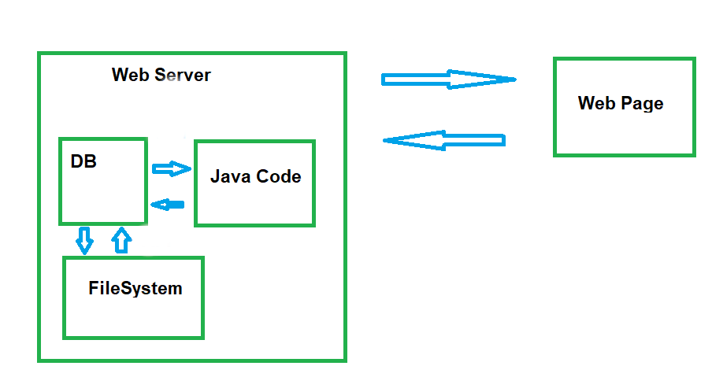
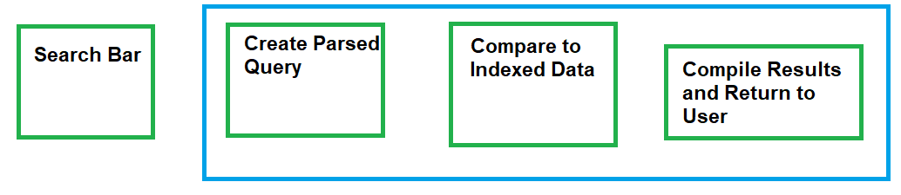
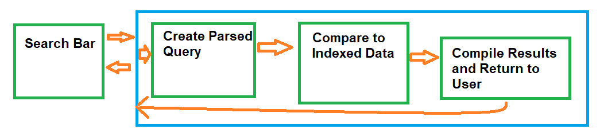
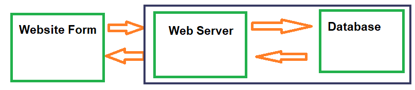
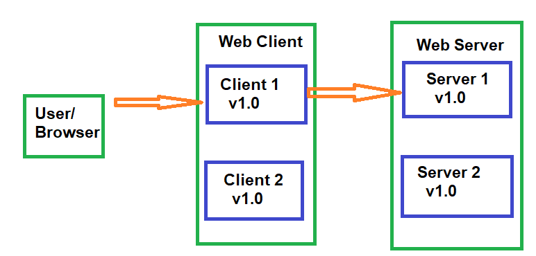
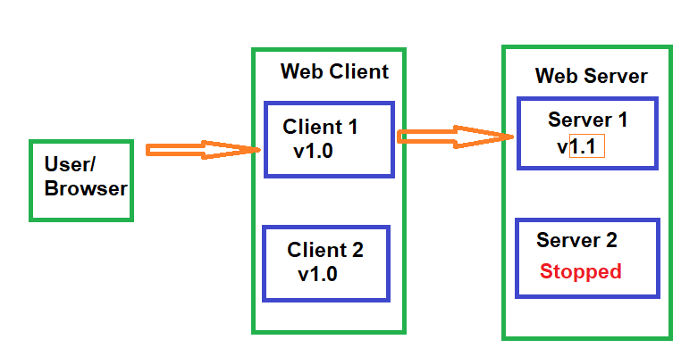

---

marp: true
size: 16:9
theme: default

---

# APIs

---

# Top-Down vs Bottom-Up Design

---

## Bottom-Up Design

### Common pitfall: Starting with the details first

Your first instinct is to start coding the first component you think of, then move on to the next, and so on. This often leads to a tangled mess of code that is difficult to maintain and extend.


---

## Top-Down Design

#### Better solution: Decide how the components fit together, then build them

Figuring out the overall architecture first allows you to focus on one component at a time, and makes it easier to reason about how the system works as a whole.


---

## Building a System

We have decided on the Top-Down approach, but how do we actually build a system? And how do the components interact with each other?

Let's start with component communication. 

---

# What is an API?

**A**pplication **P**rogramming **I**nterface

 - It sits between **layers** or **components** in a system and allows them to communicate with each other.
- It defines a **contract** for how the components will behave.
- It encompasses everything an external component **relies on** to interact with the system.
---

# API Example

### Cars have an API:

- Use the steering wheel to steer
- The gas to go
- The brake to stop


### Users don't need to know the details:

- Drive\-by\-wire vs mechanical linkages

- Different types of brake disks

- How an internal combustion engine works

---

<style scoped>
section {
  font-size: 24px;
  margin-top: 0px;
}
</style>

# Why APIs?


Allows  __interacting__ with a component without knowing the  __details__ of how it works


### Important for scaling software:

- Each piece is complicated\, no one can keep track of all details at once

### APIs let you focus on just one piece at a time

- Any separation between components has an  **implicit**  API\,  not necessarily a good one \(organic APIs are usually bad\)

### Side benefit: Promotes better design

- Highly\-coupled components tend to be  __fragile__

- APIs push design to a  __top\-down__  approach\, which produces more flexibility 

---

<style scoped>
section {
  font-size: 23px;
  margin-top: 0px;
}
</style>

# Component APIs

Any boundary between components needs an API:

- **Network**: Send data between different computers

- **Process**: Send data between different processes on the same computer

- **Conceptual**: Send data between different parts of the same process
 `Not enforced by hardware (newtork) or operating system (process)`



---

# Component APIs

Label the APIs on the diagram:


---

<style scoped>
section {
  font-size: 23px;
  margin-top: 0px;
}
</style>

# Component APIs

* **Network**: The API between the **Web Server** and the **Web Page**, which facilitates communication across client and server network boundaries.
* **Process**: The API between the **Java Code** and the **DB** (Database), which typically crosses separate operating system processes or standard database connection daemons.
* **Conceptual**: The API between the **DB** and the **FileSystem**, which represents logical boundaries and data organization internal to the architecture.


---

# System Design Diagram

- Used to identify where APIs are needed

- Helpful first step before architecting a large system

- Useful for parallelizing work across many people/teams

- Acts like an informal UML


---

# System Design Diagram

## Start with an overall workflow for the system

<style scoped>
section {
  font-size: 23px;
}
</style>

1. **Initial Layout**: For each step, assign it to a component draw a box and label it.

2. **Environmental Features:** Surround any components that live on either the same physical computer or in the same process with an extra box.

3. **Interactions:** Each time a component interacts with another, draw an arrow to connect them. These will be the APIs.

4. **Simplify:** Sometimes two components will be the **request/response**  steps for a single user action; identify these and combine them into a single component. Similarly if any components are the  **only component** within a server/process boundary, you can remove the double box around them.

__Note:__ a component from 'outside' a box should only interact with the outermost layer\, which in turn will interact with internal components; this separates external and internal APIs to simplify backwards\-compatibility guarantees

---

# System Design Diagram

When have you simplified enough?

 - Whenever possible, have **pairs of arrows** between components representing **request/response** pairs

A system with a  __single arrow__  is unusual and more complicated:

- A single arrow means there  **is no response** to indicate that a task is completed, successful, or failed.

- Any such system also needs components to **monitor and potentially redo** the task in question

---

<style scoped>
section {
  font-size: 25px;
}
</style>

# Systems Design Diagrams:  Single Arrows

Both of these scenarios represent single arrows in a systems design diagram.

#### For protocols with no response ( SMTP): "Resend this email."

There is no way to remove the single arrow, you just need to build a way to resend.

#### Tasks with delayed response:

* Add some sort of ID or lookup key response
* Add another component to "check status" using the key

*Example:* Placing an order on a website returns an order number, which allows someone to look up the status of the order over several days.

---

# Systems Diagrams Example

Example: Adding a 'Search' feature to an application

__Overall workflow__ :

A user will enter terms in the search bar and hit enter\. That request will go to a server that will create a parsed version of the query\, then compare that against indexed data\. The results will be compiled into a user\-friendly format and then returned to the application\.

---

# Systems Diagrams Example

__Overall workflow__ :

A user will enter terms in the search bar and hit enter\. That request will go to a server that will create a parsed version of the query\, then compare that against indexed data\. The results will be compiled into a user\-friendly format and then returned to the application\.

__Step 1:__  Create a component for each step


---

# Systems Diagrams Example

__Step 2:__  Add server/process boundary boxes



---

# Systems Diagrams Example

__Step 3:__  Draw component interactions



---

# Systems Diagrams Example

__Step 4:__  Combine request/response components & remove extra boxes


---

<style scoped>
section {
  font-size: 25px;
}
</style>

# Systems Diagrams Example

Now we can read the required APIs off the diagram:

- One network API from the search bar to the network facing server (needs  *wire* compatibility)

- One internal in-process API from the networking layer to the query-parsing/translation component

- One internal in-process API from the parsing component to the indexed data searching component.


---

<style scoped>
section {
  font-size: 22px;
}
</style>

# Your turn!

Create a systems diagram for the following workflow:

A user will enter data in a website form and submit it. That information will get sent to the server, which will transform it into a SQL query and send that to a database. The database results will get transformed back into javascript-friendly results, and returned to the website to be displayed.

Run through the four steps to create the systems diagram:

1. **Initial Layout:** For each step, assign it to a component and draw a **box** with a label.

2. **Environmental Features:** Surround any components that live on either the same physical **server** or in the same **process** with an extra box.

3. **Interactions:** Each time a component interacts with another, draw an **arrow** to connect them. These will be the APIs.

4. **Simplify:** Sometimes two components will be the **request/response** steps for a single user action; identify these and combine them into a single component. Similarly, if any components are the **only component** within a server/process boundary, you can remove the double box around them.

---


# Web Form Systems Diagram

A user will enter data in a website form and submit it\. That information will get sent to the server\, which will transform it into a SQL query and send that to a database\. The database results will get transformed back into javascript\-friendly results\, and returned to the website to be displayed\.


---

# Web Form Systems Diagram (Alt)

What's different here?

Why would you choose one vs the other?



---

# Designing the API

The API is the layer  __between__  components\, and acts as a  __contract__  between them

Each component has a copy of the contract\, but "the API" isn't a single piece of code


---

<style scoped>
section {
  font-size: 25px;
}
</style>

# Designing a Good API

APIs should be designed from the perspective of the  **user**, not the implementer

- Avoids a "leaky abstraction", where details of how a component works end up in the API

- Captures behavior, not data (although the line can be blurry)

- Needs enough power to be useful, but also an easy learning curve

- Make the common things easy, and the weird things possible

Remember: you can always  **add**  things to an API, but it's difficult to  **remove**  or  **change** things

Initially, aim for a Minimum Viable Product (MVP) approach - what's the smallest set of things that will let a user accomplish what they need to

---

# Backwards Compatibility

For widely used, public open source projects (Ex: protocol buffers, the JRE):

- Many clients

- No complete list of all clients\, much less access to their code

⇒ Breaking changes are a Big Deal\, and very rare

Ever wondered why generics are wonky in Java? To maintain 1.4/1.5 compatibility

---

# Backwards Compatibility

Some APIs have a narrower scope: within a company, team, or project

Backwards compatibility is still important!

Consider a simple web server: a client process and a server process

When upgrading, one option is to turn everything off, upgrade everything, and then turn it back on

Ex: "Caution: AmateurHour.com will be going down for maintenance from 3am to 6am on Friday"


---

# Online Updates

Better option: At least 2 copies of every process with network failover.

Ex: a user is connected to Client 1, which starts off connected to Server 1; both clients/servers are running identical software



---

  # Online Updates

To update to v1.1: first stop the Server 1 process. Client 1 will fail over to Server 2; this will at worst cause a browser -refresh style hiccup for a user, but typically it's not noticeable.


---

# Online Updates

Now, update the binaries on the server, start Server 1 back up, and do the same for Server 2.



---

# Online Updates

Once the servers are updated, the clients can get sequentially updated as well. All of this relies on a client running v1.0 still being able to talk to a server with v1.1, which means the API must be **backwards compatible** for at least one version.


---

# Online Updates

In practice, this whole process is often automated, with Server 1 having to pass some automated health checks before Server 2 gets upgraded, as part of a **continuous deployment**  pipeline.


---

<style scoped>
section {
  font-size: 25px;
}
</style>

# Types of Backwards Compatibility

APIs are **contracts** between different components\, which may change and upgrade at different rates\, with different people.

It's important to maintain  **backwards compatibility**  with an API

What type of backward compatibility is actually  **part**  of the API:

- Source compatibility: code written with a previous version still compiles

- Wire compatibility: an application built against a previous version can still talk to a new server

- Semantic compatibility: an application's behavior doesn't change

---

<style scoped>
section {
  font-size: 25px;
}
</style>

# Examples of Breaking Changes

Source compatibility: code written with a previous version still compiles

Previous API:

```java
public Set<Object> createCollection();
```
Breaking Change:

```java
public Collection<Object> createCollection();
```

Why would this break?

---


---

<style scoped>
section {
  font-size: 25px;
}
</style>

# Examples of Breaking Changes

Previous API:

```java
public Set<Object> createCollection();
```
Breaking Change:

```java
public Collection<Object> createCollection();
```

The client code expects a Set, but Collection is more general and doesn't have the same guarantees as Set. The client code may be relying on the fact that the returned collection has no duplicates, which is guaranteed by Set but not by Collection.

---

<style scoped>
section {
  font-size: 25px;
}
</style>

# Examples of Non-Breaking Changes

Previous API:

```java
public Set<Object> createCollection();
```
Non-breaking Change:

```java
public TreeSet<Object> createCollection();
```

A non-breaking change is one that maintains the guarantees of the previous API. In this case, TreeSet is a specific implementation of Set, so it still satisfies the contract of returning a Set.


Make your return types as  **general** as possible

---

<style scoped>
section {
  font-size: 22px;
}
</style>

# Examples of Breaking Changes
**Wire compatibility** means that the data sent over the network must be in a format that both the client and server understand. An application built against a previous version can still talk to a new server.

Previous API:

Using default Java serialization (Serializable interface) to send a Widget object over the wire:

```java
public Widget createWidget();
```

Breaking Change:

- Create a new class that implements Widget and return it; Java serialization will fail on the application side

Non-breaking Change:

- Use an explicitly backwards/forwards compatible wire format such as JSON or protocol buffers

Make **serialization** and **persistence** explicit parts of the API

---

# Design For Change - Versioning

Any time something is  **serialized** (converted to a byte stream)  or  **persisted** (saved to disk)  it should have a version number

- Default for Java Serializable is serialVersionUID

Two major properties:

- The version number should an incrementing sequence

- Version should be automatically set given the compiled version of the code: ex: protocolBufferBuilder\.setVersion\(VERSION\);

---
<style scoped>
section {
  font-size: 14px;
}
</style>

# Examples of Breaking Changes

**Semantic compatibility** means that an application's behavior doesn't change.

Previous API:

````java
public float parseString(String number) throws NumberFormatException;
````

Breaking Change:

````java
/* Returns Float.NaN if the number fails to parse */
public float parseString(String number);
````

⇒ Build in **error handling** from the beginning

**Non-breaking Change:**

````java
@Deprecated /** Prefer parseStringNoThrow */
public default float parseString(String number) throws NumberFormatException {
  float result = parseStringNoThrow(number);
  if (Float.isNaN(result)) {
    throw new NumberFormatException();
  }
  return result;
}

/* Returns Float.NaN if the number fails to parse */
public float parseStringNoThrow(String number);
````

Build in **error handling** from the beginning.

---

<style scoped>
section {
  font-size: 25px;
}
</style>

# Number of Versions of Compatibility

Large open-source projects will typically support APIs for many years

- Breaking changes are indicated by incrementing the  **major** version number

Internal only or smaller projects may have shorter support windows

- Most common is one  **minor**  release

Version numbers: **major**.**minor**.**hotfix/patch** 
-  Java 1.6.u45 major=1, minor=6, hotfix=45

Generally,  **deprecate**  functionality for one support window, then remove it.

- Deprecating an API alerts developers that a feature will be removed in a future release, giving them a defined deprecation window (typically one minor release cycle for internal projects, or one major release cycle for public APIs) to migrate off the legacy code before it is fully deleted.

---

# API Design Feels Backwards

Up until now: I want to build a thing -> I go build the thing.

New and improved: I want to build a thing -> I go do something else entirely (System Design), and then eventually come back to building the thing.

Seems  **counterintuitive**, but trust the process! Somewhere around the middle of the semester, suddenly all that "something else entirely" will really start to pay off.

---

# API Design Feels Backwards

Initial API Design steps don't seem to be **getting anywhere**

Think of it like an image loading over time - the first few steps are really blurry, but they're still important.


---

# API Example: Building a Server For a Website

After building the System Design Diagram\, focus on each API between components.

- A user \(via their browser\) will connect to a web server for a social media site\. Initially\, we just want the user to be able to view their profile and make changes to it\.


---

# API Example: Building a Server For a Website

__Step 1__ : Identify the  __client__

In this case\, the website frontend.

*Note:* The client isn't always a person, or the  **end user**. In most cases, the client is another piece of code that interacts with your system.

---

# Your Turn! (Part 1 of Many)

After seeing how each piece works with our social media site example, you’ll implement the same part of the process with a different system

Goal: You've been asked to build a key-value store system, where another program can store and retrieve arbitrary bytes of data.

Step 1: Who is the **client** for this system?


---


# Part 1 Solution

Goal: You've been asked to build a key\-value store system\, where clients can store and retrieve arbitrary bytes of data\.

The **client** will likely be another piece of code:

- Web server

- Another backend server

- Probably not an actual person

*Note:* The client isn't hostile and can be trusted. The client is likely unique, no need to manage different profiles.

---

# API Example: Building a Server For a Website

**Step 2:**  List out what the user needs to be able to do.

In our case, that might be:

- Log in to the site

- Load a profile

- Make changes to the profile

---

# Your Turn! (Part 2)

Goal: You've been asked to build a key-value store system, where clients can store and retrieve arbitrary bytes of data.

The **client** will be another piece of code (some sort of server)

Step 2: List out what operations the client will need to perform.

---

# Step 2 Solution

Goal: You've been asked to build a key-value store system, where clients can store and retrieve arbitrary bytes of data.

The functionality it needs to support:

1. Store bytes of data

2. Later, look up the corresponding data


---

# Writing the Actual API

**Step 3:**  Build a prototype

To go from a high-level approach to the actual code, build a **prototype use case**.

This isn't an actual website, or anything that will ever be used; it's to iron out the details to make sure the API is both well-specified and sufficiently powerful.

Where the actual website will have forms for input, responses to user actions, etc, the prototype just focuses on the **interactions** with the API

Start with the high-level approach as comments, and fill it out as you go

---

<style scoped>
section {
  font-size: 25px;
}
</style>

# Writing the Actual API (Next Checkpoint)

Prototypes are frequently  __JUnit Tests__ \, we haven't covered testing just yet.

For now, the prototype for SomeApi will have the format:

PrototypeSomeApi.java

```java
public class PrototypeSomeApi {

    public void prototype(SomeApi server) {
        // prototype goes here
    }

}
```

This code isn't accessible from any code entry points (no main method or @Test annotation), so it will never  **run**, and that's ok!

Prototype code just needs to **compile**!

---

# Prototype the Use Case

First, just add comments:

```java
public class PrototypeSomeApi {
    
    public void prototype(WebServer server) {
        // log in the user
        // load their profile
        // make a change to the profile
        // reload the updated version of the profile
    }

}

```

This step will often flag functionality that was missed during the initial brainstorming\, such as a "log out" option.

---

# Prototype the Use Case

First, just add comments


```java
public class PrototypeSomeApi {
    public void prototype(WebServer server) {
        // log in the user
        // load their profile
        // make a change to the profile
        // reload the updated version of the profile
        // log out
    }


```

All fixed!

---

# Making Code Compile

The previous slide created a new **type**  (WebServer) that doesn't exist yet, so the code won't compile.

As you're writing the code, you want it to compile. When you have a referenced type that you haven't implemented yet, create it as an  **empty interface:**

WebServer.java:

```java
public interface WebServer {
    // nothing here yet!
}
```

Your IDE can help you with this!

---

# Your Turn! (Part 3)

Goal: You've been asked to build a key\-value store system, where clients can store and retrieve arbitrary bytes of data.

The **client** will be another piece of code, such as another server.

The functionality it needs to support:

1. Store bytes of data

2. Later, look up the corresponding data

Create a  **PrototypeDataStore.java**  with the comments and  methods version of the API.

*Hint*: This should compile, so you may need to create an empty interface

---

<style scoped>
section {
  font-size: 25px;
}
</style>

# Part 3 Solution

PrototypeDataStore.java:

```java

public class PrototypeDataStore {

    public void prototype(DataStore dataStore) {
        // store some data
        // retrieve the data
    }

}
```

DataStore.java:

```java
public interface DataStore {
    // nothing here yet!
}
```

---

# Prototype the Use Case

**Step 4** : Fill out the template

```java
public void prototype(WebServer server) {
    // log in the user: what do we need to build a LoginRequest?
    LoginResponse response = server.login(new LoginRequest());
    // load their profile
    // make a change to the profile
    // reload the updated version of the profile
    // log out
}

```


Often, filling in the first few lines doesn't seem like it's actually clarifying anything, but you'll notice we now have two concrete interfaces and a method. Remember, this first pass is still fairly high-level and vague; leave further needed details as comments.

---

# API Design Best Practice: Always Have a Return Value

```java
LoginResponse login(LoginRequest loginRequest);
```

Why not  **void** ?

Return values allow you to:

- Handle error cases more gracefully

- Propagate exceptions across network/process boundaries

- Add functionality later without breaking backwards compatibility

---

# Prototype the Use Case

```java
public void testWebServer(WebServer server) {
    // log in the user: what do we need to build a LoginRequest?
    LoginResponse loginResponse = server.login(new LoginRequest());

    // load their profile
    if (loginResponse.success()) {
        ProfileLoadResponse profileLoadResponse = server.loadProfile(loginResponse.getUserIdentifier());
    }

    // make a change to the profile
    // reload the updated version of the profile
    // log out
}
```


As we fill out the next few lines, we'll start to implicitly fill out some of the interfaces; we need to know if the login worked, and in order to load a profile we need a user id, which we would have to get from the login info (good thing we had a response!)

---

# API Design Best Practice: Wrapper Interfaces

```java
ProfileLoadResponse loadProfile(UserIdentifier user);
```

Why not 'String username' or 'long userId'?

Exactly!

How the system wants to implement a unique id per user is an **implementation detail**.

Leaving it unspecified allows for a flexible implementation\, or multiple/changing implementations.

---

# Prototype the Use Case

```java
public void testWebServer(WebServer server) {
    // log in the user: what do we need to build a LoginRequest?
    LoginResponse loginResponse = server.login(new LoginRequest());

    // load their profile
    if (loginResponse.success()) {
        ProfileLoadResponse profileLoadResponse = server.loadProfile(loginResponse.getUserIdentifier());
    
    // make a change to the profile: what do we need to create one of these
        ProfileChangeRequest changeRequest = new ProfileChangeRequest();
        ProfileChangeResponse profileChangeResponse = server.updateProfile(loginResponse.getUserIdentifier(), changeRequest);

    // reload the updated version of the profile
        profileLoadResponse = server.loadProfile(loginResponse.getUserIdentifier());
    
    // log out
        server.logout(loginResponse.getUserIdentifier());
    }
}
```

---

<style scoped>
section {
  font-size: 25px;
}
</style>

# API Design Best Practice: Many Object Interfaces

```java
ProfileChangeResponse changeProfile(UserIdentifier user, ProfileChangeRequest request);
```

Shouldn't we be reusing code and combining some of these response values?

Nope!

- Copy-pasting  **logic** is bad, that's something you encapsulate and re\-use

-   Reusing  **methods**  is also a good idea

- On the other hand, allow wrapper **interfaces** to proliferate wildly

Leaving these separate allows for future flexibility

- Reuse is great for situations where you control all uses of the code\, but APIs are the opposite

tldr: **Types** = don't reuse, **Methods** = do reuse

---

# Writing the actual API: Method Signatures

```java

public interface WebServer {

    LoginResponse login(LoginRequest loginRequest);

    ProfileLoadResponse loadProfile(UserIdentifier user);

    ProfileChangeResponse changeProfile(UserIdentifier user, ProfileChangeRequest request);

    LogoutResponse logout(UserIdentifier user);

}
```


---

# Your Turn!

Recall from earlier:

```java
public void prototype(DataStore dataStore) {
    // store some data
    // retrieve the data
}
```

DataStore.java

```java
public interface DataStore {
    // nothing here yet!
}
``` 
Now, fill out each commented line, generating interfaces/methods in DataStore as necessary to make everything compile.

---

# Prototyped Data Storage Layer

```java
public void prototype(DataStore dataStore) {

    // store some data
    DataStorageResponse storeResponse = dataStore.storeData(new DataStorageRequest());

    // retrieve the data
    DataLoadResponse loadResponse = dataStore.loadData(storeResponse.getDataKey());
}
```                       


---

# Prototyped Data Storage Layer

```java
public interface DataStore {

    DataStorageResponse storeData(DataStorageRequest request);

    DataLoadResponse loadData(DataStorageKey key);

}
```

---

# Prototyped Data Storage Layer

```java
public interface DataStorageRequest {
    // TBD
}

public interface DataStorageResponse {

    DataStorageKey getDataKey();

}

public interface DataStorageKey {
    // TBD
}

public interface DataLoadResponse {
    // TBD
}

```

---

# Writing the actual API: Filling in the Rest

```java
public interface LoginResponse {

    boolean success(); //Oh no! Booleans are bad!

    UserIdentifier getUserIdentifier();

}

public interface UserIdentifier {
    // TBD
}
```

---


# API Design Best Practice: Booleans are Bad (Usually)

Problem 1: Very inflexible (only ever has two values)

- What happens if we want to add details about why the login failed?

Problem 2: Not self\-documenting

- ex: server\.loadProfile\(true\, false\, true\, true\, false\, ""\);

**The fix**: Enums

---

# Enums (Enumerations)

Alternative to listing out a bunch of constants.

Use ==, not .equals()

Should only be used for known-at-compile-time, immutable state. Meaning the set of possible values is fixed and cannot change at runtime.

---

# Updated API

```java
public interface LoginResponse {

    LoginResponseCode getResponseCode();

    UserIdentifier getUserIdentifier();

}

public enum LoginResponseCode {

    SUCCESS,
    FAILURE;

}
```

---


# Updated Prototype

```java
public void testWebServer(WebServer server) {

  LoginResponse loginResponse = server.login(new LoginRequest());

  // load their profile
  if (loginResponse.getResponseCode() == LoginResponseCode.SUCCESS) {
    // etc
  }

}
```

Better for flexibility, but we've sacrificed some usability. We've made it harder to do the "easy thing" (check if a login was successful) and easier to do the "hard thing" (get details about the login failure).


---

<style scoped>
section {
  font-size: 25px;
}
</style>

# Encapsulated Booleans

```java
public enum LoginResponseCode {

  SUCCESS(true),
  FAILURE(false);

  private boolean success;

  private LoginResponseCode(boolean success) {
    this.success = success;
  }

  public boolean success() {
    return success;
  }

}
```

*Note:* Adding a layer of **indirection** gives us flexibility plus usability.


---

# More Updated Prototype

```java

public void testWebServer(WebServer server) {

  LoginResponse loginResponse = server.login(new LoginRequest());

  // load their profile
  if (loginResponse.getResponseCode().success()) {
    // etc
  }

}
```

That looks better! The 'easy thing' (see if a login happened) is still easy, but now more complicated things (details of the login success/failure) are possible.

---

<style scoped>
section {
  font-size: 25px;
}
</style>

# Encapsulated Booleans

```java
public enum LoginResponseCode {

  SUCCESS(true),
  FAILURE(false);
  UNKNOWN_USERNAME(false);

  private boolean success;

  private LoginResponseCode(boolean success) {
    this.success = success;
  }

  public boolean success() {
    return success;
  }

}
```

We can add more detailed failure modes in a **backwards-compatible way**.

---

<style scoped>
section {
  font-size: 25px;
}
</style>

# Default Values

"Make the common case easy"

Wherever possible, provide default values in the API (usually **configuration settings**)

- Built-in example use case
- Low cost to start using the API
- Note that changing a default is a **semantic** break; use commonly-useful defaults rather than sentinel values

Ex: the number of threads to use for an execution. Depending on the program, you might use:

- 1 ⇒ Multi-threading is an advanced option not generally needed

- 4 ⇒ Given how the code is written, more threads will tend to get stuck waiting on locks

- Runtime.getRuntime().availableProcessors() ⇒ Allows the program to self-tune by default

- -1 ⇒ This would be a bad default value

---

# Default Values

How to implement this?

For **cross-network/cross-process** APIs, typically done during deserialization

For **in-process** APIs, typically done by overloading a method:

```java
public default int calculateValue(int input) {
    return calculateValue(input, DEFAULT_NUM_THREADS);
}

public int calculateValue(int input, int nThreads);
```

---
# Let's Review!

What you should know about API Design that might be on an exam:

**Design principles for an API** : What the design process is\, what concerns to keep in mind\, common pitfalls/best practices

**Prototyping an API** : What this looks like\, why it's useful

**Types of backwards compatibility** : What they are\, when to use them

**Systems Diagrams** : What they are\, how to draw them\, why to use them

---

# Checkpoint 2: APIs for the Project

**Github Issues** :

Useful for tracking bugs\, feature requests\, and \(for this assignment\)  **tasks**

Associate with a  **pull request**

Optional, can be good practice with a bug queue

Lightweight, not integrated with github: Asana
