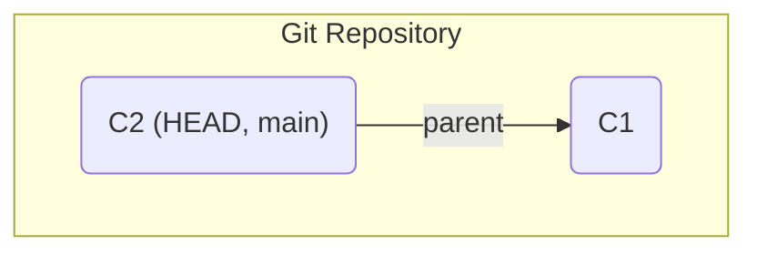
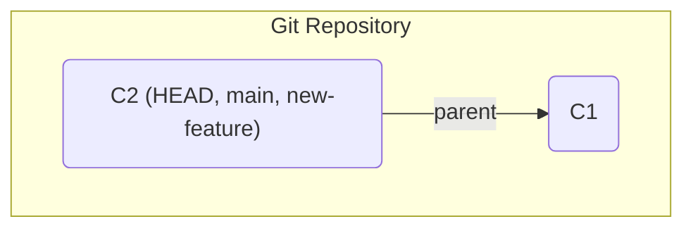
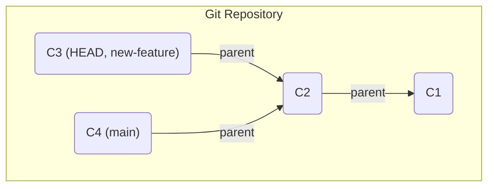
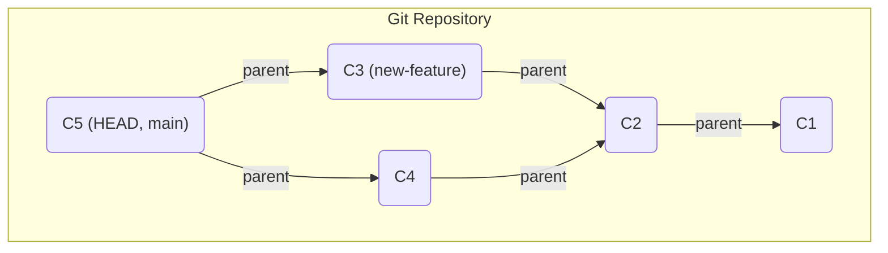

# Lecture 2: Git Branching, Merging, and Collaboration

---

## Today's Plan

1.  **Recap:** The Git Basics
2.  **Branching:** What, Why, and How?
3.  **Merging:** Combining Work
4.  **Collaboration:** Working with Remotes (GitHub)

---

## Part 1: Recap

- **Repository:** The `.git` directory, containing the entire history of your project.
- **Working Directory:** The current state of your files.
- **Staging Area:** Where you prepare ("stage") changes for the next commit.
- **`git add`:** Stages changes.
- **`git commit`:** Saves a snapshot of the staging area to the repository.
- **`git status`:** Shows the current state of your working directory and staging area.
- **`git log`:** Shows the project's commit history.

---

## Part 2: Dissecting the `.git` Directory

**Goal:** Let's build a commit from scratch. We will use low-level "plumbing" commands to see how the high-level commands (`add`, `commit`) work.

**Setup:**
```bash
$ mkdir git-guts
$ cd git-guts
$ git init
$ echo 'hello world' > file.txt
```

---

### Step 1: The Blob - Content

First, we create a **blob** object directly from our file's content. A blob is just the raw data, nothing else. The `git hash-object` command does this.

```bash
$ git hash-object -w file.txt
3b18e512dba79e45ba5247a241e01869804bb950
```
- The `-w` flag tells Git to write this object to its database in `.git/objects`.
- The output is the SHA-1 hash of the blob object. This is its unique ID.

We can verify this with `git cat-file -p <hash>`:
```bash
$ git cat-file -p 3b18e512dba79e45ba5247a241e01869804bb950
hello world
```
We have now stored our content, but Git doesn't know its filename or where it belongs.

---

### Step 2: The Tree - Structure

Next, we need a **tree** object to represent a directory. A tree maps filenames to blobs (for files) or other trees (for subdirectories).

The staging area (the "index") is where we build our next tree. Let's add our blob to the index.

```bash
# The low-level way to 'git add'
$ git update-index --add --cacheinfo 100644 3b18e512dba79e45ba5247a241e01869804bb950 file.txt
```
Now we can write the contents of the index to a tree object:

```bash
$ git write-tree
6e6234050a12a5122ee3a55225577e5901844222
```
This creates a tree object and gives us its hash. Let's inspect it:
```bash
$ git cat-file -p 6e6234050a12a5122ee3a55225577e5901844222
100644 blob 3b18e512dba79e45ba5247a241e01869804bb950    file.txt
```
The tree object connects the filename `file.txt` to the content `3b18...`.

---

### Step 3: The Commit - The Snapshot

Finally, we create a **commit** object. This links our tree with metadata (author, message) and a parent commit.

```bash
# The -m flag is the message. The output is the commit hash.
$ echo 'First commit' | git commit-tree 6e6234050a12a5122ee3a55225577e5901844222
f2b87c3746cb618584283896b052f53434d32e5b
```
Let's inspect our brand new commit object:
```bash
$ git cat-file -p f2b87c3746cb618584283896b052f53434d32e5b
tree 6e6234050a12a5122ee3a55225577e5901844222
author Mike <mike@example.com> 1678886400 -0400
committer Mike <mike@example.com> 1678886400 -0400

First commit
```
Notice there is **no parent** line. This is the root commit.

---

### Step 4: Linking Commits - The "Directed" in DAG

Let's make a second commit.

```bash
$ echo 'hello again' > file.txt
$ git hash-object -w file.txt  # New blob: 233e...
$ git update-index ...         # Update index with new blob
$ git write-tree               # New tree: 9f8a...
```
Now, we create the commit, but this time we specify the **parent** with the `-p` flag.

```bash
$ echo 'Second commit' | git commit-tree 9f8a... -p f2b87c...
8a1b2c3d...
```
Inspecting this new commit shows the parent link:
```bash
$ git cat-file -p 8a1b2c3d...
tree 9f8a...
parent f2b87c...
author ...

Second commit
```
---

### Visualizing the DAG: Linear History

This is the simplest case. Each commit points to its parent. The `main` branch pointer and `HEAD` just move forward with each commit.


*A new commit `C2` is made on `main`. It points to its parent `C1`.*

---

### Visualizing the DAG: Creating a Branch

When you run `git branch <new-branch>`, all you do is create a new pointer to the current commit. Nothing else changes.


*`git branch new-feature` creates a new pointer. It's cheap!*

---

### Visualizing the DAG: Divergent History

Now, you `checkout new-feature` and make a new commit, `C3`. At the same time, someone else commits `C4` to `main`. The history has now diverged.


*Both `C3` and `C4` share a common ancestor, `C2`. This is the classic "fork" shape.*

---

### Visualizing the DAG: The Merge Commit

To bring the diverged history back together, you `checkout main` and run `git merge new-feature`. This creates a special **merge commit**, `C5`.


*The merge commit `C5` is special because it has **two parents**, tying the two diverged branches together.*

---


---

### The Conflict!

Now, when we're on `main` and we try to merge...

```bash
$ git merge feat/multiply
Auto-merging Calculator.java
CONFLICT (content): Merge conflict in Calculator.java
Automatic merge failed; fix conflicts and then commit the result.
```
**Git could not merge automatically!** The same lines were changed in both branches.

---

### Resolving the Conflict

1.  **Check `git status`:** It tells you which file is conflicted.
2.  **Open the file:** Git modifies the file to show you the conflict.

```java
public static void main(String[] args) {
<<<<<<< HEAD
    Calculator calc = new Calculator();
    System.out.println("2 + 2 = " + calc.add(2, 2));
=======
    System.out.println("Hello from our Calculator!");
>>>>>>> feat/multiply
}
```
- `<<<<<<< HEAD`: This is the version from your current branch (`main`).
- `=======`: This separates the two versions.
- `>>>>>>> feat/multiply`: This is the version from the branch you're merging.

---

### Finishing the Resolution

3.  **Edit the file:** Manually edit the code to be what you want. Remove the conflict markers.
    ```java
    // The desired final version
    public static void main(String[] args) {
        Calculator calc = new Calculator();
        System.out.println("2 + 2 = " + calc.add(2, 2));
        System.out.println("Hello from our Calculator!");
    }
    ```
4.  **Stage the change:** `git add Calculator.java`. This tells Git "I'm done resolving".
5.  **Commit:** Run `git commit`. Git will pre-populate a commit message for you.

---

## Part 4: In-Class Exercise (15 minutes)

**Simulating Collaboration**

1.  **Partner up!** One person is "Developer A", the other is "Developer B".
2.  **Developer A:**
    - Create a new repository with a `README.md` file.
    - Create a branch named `dev-A-branch`.
    - On that branch, add your name to the `README.md`. Commit the change.
3.  **Developer B:**
    - Clone Developer A's repository (A will need to put it on GitHub/GitLab first).
    - Create a branch named `dev-B-branch`.
    - On that branch, add your name to the `README.md` on a *different line*. Commit.
4.  **Both:** `git push` your branches to the remote.
5.  **Challenge:** Try to merge both branches into `main`. Will there be a conflict? How can you work together to get both of your names into the final `main` branch?

---

## Next Time

- **Lecture 3:** Static Checking & Code Quality
- We will move from the mechanics of version control to the principles of writing high-quality code.
